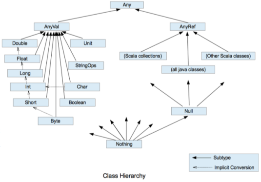

## 📌 常量与变量

```scala
object Learn01_VarVal {
  def main(args: Array[String]): Unit = {
    var a: Int = 10 // var定义变量variable，必须要有初始值
    val b: Int = 20 // val定义常量value，必须要有初始值
    var a1 = "定义变量时可以省略变量类型，类型由编译器自动推导"
    val b2 = "定义常量也是同理，但常量不可改"
    val _whm = new StudentScala("_whm", 26)
    _whm.age = 27
    _whm.printInfo()

    var +-*/#! = "操作符命名的变量" // 变量可以以操作符作为命名，且只能有操作符，包括+-*/#!等
    var `object` = "反引号+关键字命名的变量" // 以反引号包括起来的关键字也可作为变量命名
  }
}
```

## 📌 字符串格式化输出

|                 方式                 | 补充说明                       |
|:----------------------------------:|:---------------------------|
| `printf("姓名：%s，年龄：%d", name, age)` | `%s`、`%d`作为占位符，类似C语言的格式化输出 |
|     `s"姓名：${name}，年龄：${age}"`      | 字符串模板                      |
|     `f"圆周率保留2位小数：${pi}%2.2f"`      | %2.2f，第一个2表示字符长度不足2时，以空格补全 |
|     `"%.2f".format(10.0 / 3)"`      | Scala 3.4.1："Use `formatString.format(value)` instead of `value.formatted(formatString)`" |
|   `raw"圆周率保留2位小数：${pi}%2.2f\n"`    | raw表示原样输出，不会转义             |
|             使用三引号包括字符串             | 保持多行字符串原格式，复杂的SQL语句可以用     |


```scala
object Learn02_Str {
  def main(args: Array[String]): Unit = {
    var name: String = "whm" // var定义变量variable，必须要有初始值
    val age: Int = 26 // val定义常量value，必须要有初始值
    // 字符串格式化输出printf
    printf("姓名：%s，年龄：%d", name, age)
    println()

    // 字符串模板
    println(s"姓名：${name}，年龄：${age}")
    val pi = 3.1415926
    println(f"圆周率保留2位小数：${pi}%2.2f") // %2.2f，第一个2表示字符长度不足2时，以空格补全
    println(raw"圆周率保留2位小数：${pi}%2.2f\n") // raw表示原样输出，不会转义

    // 三引号包括起来字符串，保持多行字符串原格式，复杂的SQL语句可以用
    var tmp =
      s"""--首先执行了两个表的笛卡尔积，然后通过WHERE子句进行筛选。
         |WITH A AS (SELECT ROWNUM AS RN1, T.* FROM scores T where t.subject = 'math') ,
         |    B AS (SELECT ROWNUM AS RN2, T.* FROM students T )
         |    SELECT * FROM A, B WHERE A.RN1 = B.RN2 AND A.STUDENTNAME = ${name};
         |""".stripMargin
    println(tmp)
  }
}
```

## 📌 读写文件

```scala
object Learn03_IO {
  def main(args: Array[String]): Unit = {
    // 控制台输入输出
    println("请输入字符串：")
    val str = StdIn.readLine()
    println("请输入数字：")
    val value = StdIn.readInt()
    println(str + " " + value)

    // 写入文件
    val writer = new java.io.PrintWriter("resource/learn03_IO.txt")
    writer.write("Hello scala by java writer\n")
    writer.write(raw"Hello world!\n")
    writer.close()

    // 从文件中读取
    val file = scala.io.Source.fromFile("resource/learn03_IO.txt") // 路径默认为项目根目录
    file.foreach(print)

  }
}
```

## 📌 Java IO

```java
public class JavaIOReview {
    // 字节流与字符流，两者不能混用（无法确定多少个字节等于一个字符），或者先提前做转换。
    // InputStream字节流-适用于处理二进制数据，如图片、音频、视频或任何非文本文件。
    // Reader字符流-专门用于处理文本数据，通常需要指定字符编码，如 "UTF-8"。
    public static void main(String[] args) throws IOException {
        // FileInputStream-文件字节流，每读取一个字节直接打印
        // 加多一层缓冲BufferedInputStream，先读取到缓冲，超过阈值再打印，批处理以提高效率
        InputStream in = new BufferedInputStream(new FileInputStream(path));
        int i = -1;
        while ((i = in.read()) != -1) {
            System.out.print((char) i);
        }
        // 通过装饰者模式，核心功能不变的同时，扩展更丰富的功能。
        Reader in2 = new BufferedReader(new InputStreamReader(new FileInputStream(path), "UTF-8"));
        String s = null;
        while ((s = ((BufferedReader) in2).readLine()) != null) {
            System.out.println(s);
        }

    }
}
```

## 📌 数据类型

* Scala中所有数据都是对象，都是Any的子类。
* 分为两大类，数值类型`AnyVal`和引用类型`AnyRef`。
* 隐式转换时按精度递增转换：`Byte` `Short` `Int` `Long` `Float` `Double`
* `Byte` `Short` `Char`三者需要进行计算需要先转换为Int类型




```scala
object Learn04_DataType {
  def main(args: Array[String]): Unit = {
    // 1.整数类型：Byte Short Int Long
    val a: Long = 1111111111111111L // 声明数值时默认为Int，加上L后缀才代表Long
    val b1: Byte = 10 // Byte数值范围：-128 ~ 127
    val b2: Byte = (b1 + 127).toByte // 强制类型转换，但溢出
    println(b2) // 打印-119

    // 2.浮点类型：Float Double，精度递增
    val f1: Float = 3.14F // 声明小数时默认为Double，加上F后缀才代表Float

    // 3.字符类型
    val c1: Char = 'a'
    val i1: Int = c1 // 实际是字符'a'的ASCII码，即97

    // 4.布尔类型
    val flag: Boolean = true // 或者false

    // 5.空类型
    // 5.1.空值Unit，类似void，Unit只有一个实例值()
    def test(): Unit = {
      println("test")
    }
    println(test())

    // 5.2.空引用Null，Null类型只有一个实例值null（所有的类都是引用类型）
    var whm = new StudentScala("whm", 26)
    whm = null

    // 5.3.Nothing，Scala中所有类型的子类，表示空类型，可以在异常处理中使用
    def test2(): Nothing = {
      throw new NullPointerException("test2")
    }
    test2()
  }
}
```