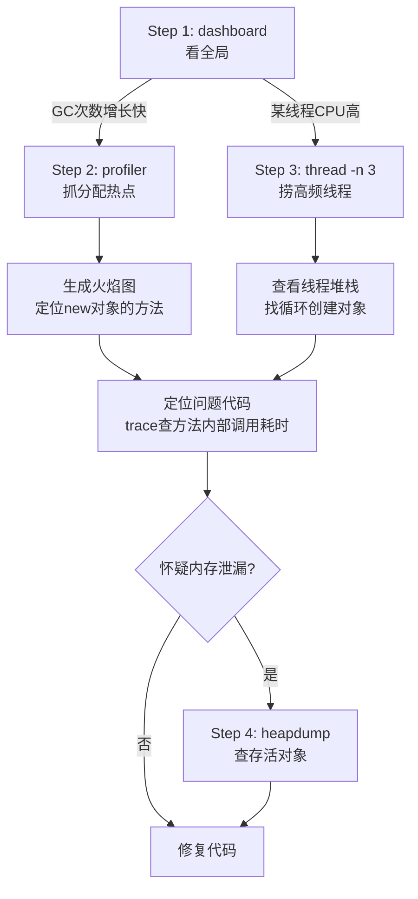
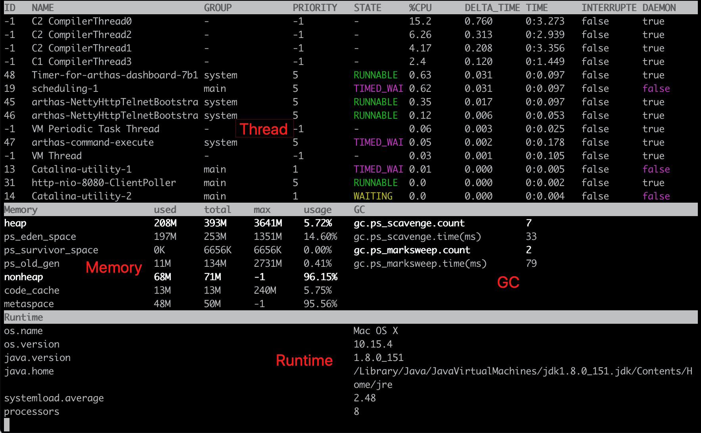

## jmx_exporter

Q: 适用于什么类型的java项目？springboot和非springboot项目都能用这个exporter么？

A: 都可；基于 JMX（Java Management Extensions） 协议，是 JVM 层面的标准接口，与框架无关。

唯一区别：启动方式

- Spring Boot 常作为 Java Agent 挂载（-javaagent:jmx_prometheus_javaagent.jar）
- 非 Spring 项目若不方便挂 Agent，可使用 JMX to HTTP Bridge 或单独开 RMI 端口让 Prometheus 拉取。

??? question "基于K8s容器化的微服务项目如何部署？"

    针对K8s容器化部署微服务项目，部署逻辑不变：每个Pod内挂载一个`jmx_exporter Agent`。

    1. 制作基础镜像，将 `jmx_prometheus_javaagent.jar` 和 `config.yaml` 提前打入业务基础镜像。
    2. 修改JVM启动参数，在Deployment的容器启动命令（ENTRYPOINT 或 args）中追加：`-javaagent:/path/jmx_exporter.jar=8081:/path/config.yaml`
    3. 暴露监控端口（Service + 注解），在Service中定义该端口，并给Pod打上注解，方便Prometheus自动发现。
    4. 资源限制，jmx_exporter本身轻量（约几十MB内存），但务必在容器的 resources.limits 中为这部分留足余量，防止OOM误杀业务进程。

## 重点监控的指标

压测时监控GC，核心目标：防范频繁GC导致“stop-the-world”（stw）停顿。

### GC频次

当GC频次过于频繁需排查是否内存泄露或大对象分配。

Q: 频次多少才是频繁？

A: 看“GC 吞吐量”（应用运行总时间 / GC总耗时），给出可落地的阈值：

- Young GC（Minor GC）：高并发下 **1~2次/分钟** 算正常；**> 5次/分钟** 即为频繁，需排查。
- Full GC：理想情况 0 次；**1次/小时** 可接受；**> 1次/30分钟** 或 一天内发生数次，即属严重频繁，必须干预。
- 硬指标：若 GC 总耗时 > 应用总运行时间的 5%~10%，说明 GC 已成为性能瓶颈。

### 停顿时间

当 Young GC 超500ms，Full GC 超200ms，通常会对高并发响应有明显影响。

Q: Young GC 和 Full GC 的关系？出现描述现象如何优化？

A: Young GC 是清理年轻代（Eden+S0/S1），存活对象晋升到老年代。老年代满了会触发 Full GC（通常连带清理年轻代+老年代+元空间）。

- Young GC 超 500ms，通常是因为年轻代过大（扫描复制耗时长）或存活对象过多。
- Full GC 超 200ms，往往是老年代空间碎片化、大对象直接进老年代或内存泄漏。

??? note "优化方向（按优先级）"

    1. 换垃圾回收器：高并发服务优先使用 G1GC（-XX:+UseG1GC），设定 -XX:MaxGCPauseMillis=200（让 JVM 自适应调节）。
    2. 调触发阈值：G1 默认老年代占比 45% 触发并发标记，若 Full GC 频繁，可调高至 `-XX:InitiatingHeapOccupancyPercent=60`，延迟 Full GC 触发点。
    3. 调大年轻代：若 Young GC 停顿时长超标，适当增大年轻代内存（-Xmn）减少晋升频率，但注意不要过大导致 Full GC 变重。
    4. 针对大对象：排查代码中一次性分配超大数据（如大 List/Map），G1 下可调 -XX:G1HeapRegionSize 避免大对象直接进老年代。

### 堆内存回收趋势

观察每次gc后存活内存，若持续阶梯上升，说明有内存泄漏风险。

## 常见案例

### rt周期性飙升

飙升时间点若跟 full gc 吻合，说明 stw 影响业务，需优化jvm参数（调大年轻代、调触发gc的内存阈值等）

### CPU飙升且GC频繁



#### Step 1：dashboard



- gc.ps_scavenge.count: Young GC 次数
- gc.ps_scavenge.time(ms): Young GC 总耗时
- gc.ps_marksweep.count: Full GC 次数
- gc.ps_marksweep.time(ms): Full GC 总耗时

以上GC指标也可通过`jvm`命令直接看汇总：`GARBAGE-COLLECTORS`区域，显示 PS Scavenge 和 PS MarkSweep 的总次数和总耗时。

!!! tip

    上文所述的“停顿时间”：当 Young GC 超500ms，Full GC 超200ms，通常会对高并发响应有明显影响。

    还有GC频次，结合容器运行时长，及上文提到的：

    - Young GC（Minor GC）：高并发下 **1~2次/分钟** 算正常；**> 5次/分钟** 即为频繁，需排查。
    - Full GC：理想情况 0 次；**1次/小时** 可接受；**> 1次/30分钟** 或 一天内发生数次，即属严重频繁，必须干预。
    - 硬指标：若 GC 总耗时 > 应用总运行时间的 5%~10%，说明 GC 已成为性能瓶颈。


#### Step 2：profiler

```bash
# 开启内存分配采样
profiler start --event alloc

# 运行1-2分钟，捕获对象分配热点
# 停止采样，生成火焰图 HTML
profiler stop
```

1. 看火焰图，找到顶层的热点方法，火焰图宽方法=频繁创建对象。
2. 使用`trace`命令进一步挖掘怀疑方法的内部调用耗时。

```bash
# 只追踪耗时 >10ms 的调用
trace com.example.UserService processOrder '#cost > 10'
```

#### Step 3：thread

1. `thread -n 3`，打印cpu占用前3的线程
2. 使用`trace`命令进一步挖掘怀疑方法的内部调用耗时。

#### Step 4：heapdump（可选）

`heapdump --live /tmp/dump.hprof`

dump live 对象到指定文件，展示存活对象实例数 Top N
