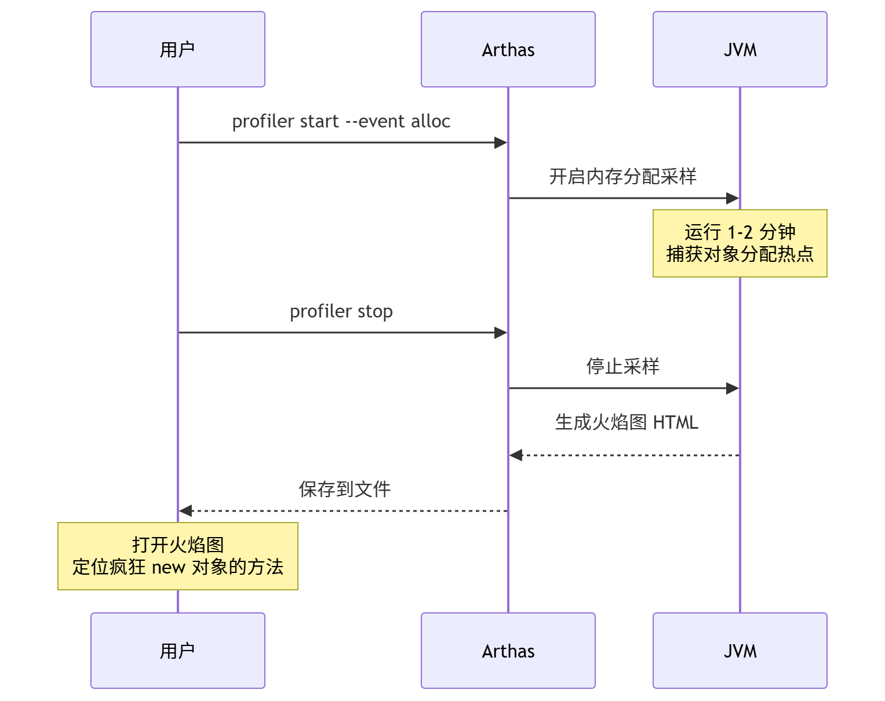
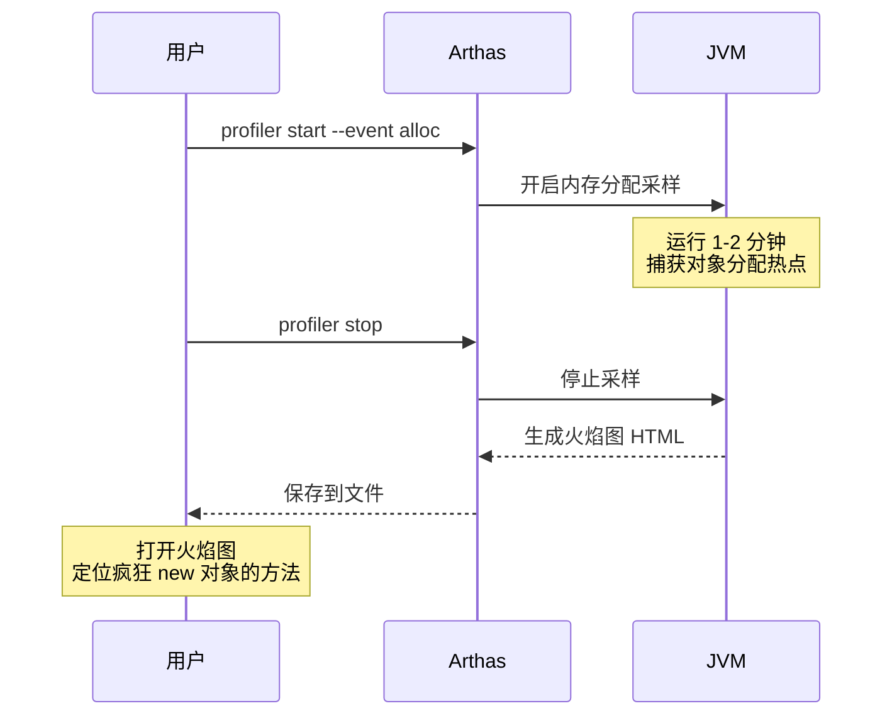

## 泳道图示例

```mermaid
sequenceDiagram
    participant U as 用户
    participant A as Arthas
    participant J as JVM

    U->>A: profiler start --event alloc
    A->>J: 开启内存分配采样
    Note over J: 运行 1-2 分钟<br/>捕获对象分配热点
    U->>A: profiler stop
    A->>J: 停止采样
    J-->>A: 生成火焰图 HTML
    A-->>U: 保存到文件
    Note over U: 打开火焰图<br/>定位疯狂 new 对象的方法
```