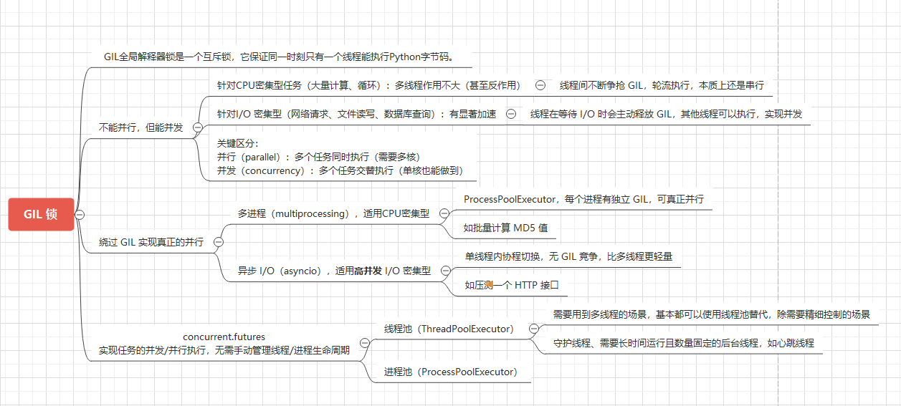

[下载该脑图](gil.eddx)

## 📌 全局解释器锁GIL

GIL全局解释器锁是一个互斥锁，它保证同一时刻只有一个线程能执行Python字节码。因此并非真正的并行，但仍可以提高程序效率。

在多线程程序中，当一个线程阻塞时，其他线程可继续执行，以提高程序的并发性和响应性（不能并行，但能并发）。

* 并行-parallel: 同一时刻，有多条指令在多个处理器（需要多核）上同时执行。
* 并发-concurrency: 同一时刻只能有一条指令执行，但多个进程指令被快速的轮换执行，使得在宏观上具有多个进程同时执行的效果。

!!! note "总结"

    * 对于I/O密集型任务（如网络请求、文件读写、数据库查询、压测接口等）和高并发场景，建议使用协程- asyncio 或多线程- thread 。
    * 对于CPU密集型任务（如加解密、图形渲染、大量计算、循环、批量计算MD5值等），使用进程- multiprocessing ，绕开GIL，实现并行。
    * 对于需要共享数据和简单的并行处理场景，可以使用线程，但需要注意Python的GIL对性能的影响。

## 📌 进程&线程&协程

程序运行时，系统会为每个进程分配不同的内存空间；而对线程而言，除了CPU，系统不会为线程分配内存，线程之间只能*共享资源*。

* 线程: CPU执行的最小单元，多线程无需申请资源，子线程和父线程共享资源，通信快于进程通信。

* 进程: 操作系统执行的基本单元，由系统分配资源和调度。

* 协程: 微线程，只有一个线程执行，当子程序内部阻塞或者I/O等待时，在多个方法间切换执行。相比多线程，省去线程切换的开销，更轻量；共享资源不需加锁，执行效率更高。

### 🚁 练习

```python
"""
有三个组装车间，分别组A、B、C三款产品，每款产品都有四个零件a1，a2，a3，a4。
零件生产商会与隔一秒生成三种产品的任一零件，并将零件发送至三个车间。
车间收到零件后，先判断是否是自己产品的零件，是则进行组装（动态加载setattr）；不是则存入库房自行认领。
组装完成后，输出至控制台。
"""
import multiprocessing
import random
import sys
import threading
import time

"""定义三种产品类 每个产品都有1234四个零件 零件动态加载"""
"""定义三个车间 用来组装产品"""
"""定义零件生产商 用来发送零件"""
"""要求使用两个进程来分别定义生产商和组装车间"""
"""要求使用三个线程来定义不同的组装车间"""


class Prod:
    # 父类
    pass


class Producer:
    """
    生产商进程，生产零件
    """
    parts = ["a1", "a2", "a3", "a4", "b1", "b2", "b3", "b4", "c1", "c2", "c3", "c4"]

    def __init__(self, queue):
        self.queue = queue  # 创建管道用于进程通信

    def make_part(self):
        """
        生产零件
        :return:
        """
        while self.parts:
            part = random.sample(self.parts, 1)[0]
            print(f"Producer生产零件: {part}")
            self.parts.remove(part)  # 不重复生产零件
            self.queue.put(part)
            time.sleep(1)  # 隔一秒生成
        print("生产结束")


class Workshop:
    warehouse = []  # 库房

    def __init__(self, queue):
        self.queue = queue  # 创建管道用于接收
        self.lock = None  # 在进程中不能先初始化线程锁

    def start(self):
        """要求使用三个线程来定义不同的组装车间"""
        self.lock = threading.RLock()
        t1 = threading.Thread(target=self.assemble, args=("A",))
        t2 = threading.Thread(target=self.assemble, args=("B",))
        t3 = threading.Thread(target=self.assemble, args=("C",))
        for t in [t1, t2, t3]:
            t.start()
        for t in [t1, t2, t3]:
            t.join()

    def assemble(self, name):
        """
        组装产品
        :param name: 车间名，如A
        :return:
        """
        # 根据传入参数动态生成子类
        inherit = type(name, (Prod,), {__doc__: f"产品子类{name}"})
        lpart = name.lower()
        # 当零件未齐全时执行
        while not all([hasattr(inherit, lpart + str(i)) for i in range(1, 5)]):
            with self.lock:
                try:
                    # 从管道接收零件
                    part = self.queue.get(True, 0.5)
                    print(f"车间{name}收到零件: {part}")
                except Exception:  # 未接收到零件时，从库房获取零件
                    if self.warehouse:
                        part = self.warehouse.pop()
                        print(f"车间{name}从库房收到零件: {part}")
                    else:
                        continue

                # 零件属于本车间时组装进类中
                if part.startswith(lpart):
                    print(f"{part}属于本车间产品，进行组装\n")
                    setattr(inherit, part, True)
                # 零件不属于本车间时存入库房
                else:
                    print(f"{part}不属于本车间产品，存入库房\n")
                    self.warehouse.append(part)

        # 停止循环时，即组装完成
        print("产品{}组装完毕".format(name), file=sys.stderr)
        # print([getattr(inherit, lpart + str(i)) for i in range(1, 5)])  # [True, True, True, True]


if __name__ == '__main__':
    queue = multiprocessing.Queue()
    producer = multiprocessing.Process(target=Producer(queue).make_part, args=())
    workshop = multiprocessing.Process(target=Workshop(queue).start, args=())

    producer.start()
    workshop.start()
    producer.join()
    workshop.join()

```
