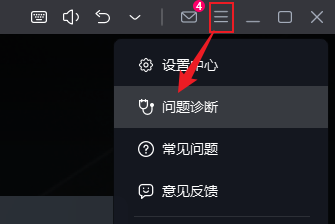

## 📌 准备工作

1. 安装adb工具，配置环境变量。
2. 模拟器设置中，关于手机->版本号，多次点击后开启开发者选项；真机还需在开发者选项中打开"USB调试"选项。
3. 命令行输入`adb devices`，列出设备信息。`127.0.0.1:xxxx`就是模拟器对应的序列号信息。  
   或者`adb -s 127.0.0.1:xxxx get-serialno`查询序列号。

!!! note "补充"

    MuMu模拟器的adb调试端口可在右上角->问题诊断中找到。若`adb devices`未打印设备列表，可以先`adb connect 127.0.0.1:16384`

    

## 📌 adb常用命令

|                      命令                      | 补充说明                         |
|:--------------------------------------------:|:-----------------------------|
|            `adb connect ip:port`             | 连接到远程设备                      |
|        `adb -s ip:port install a.apk`        | 指定设备安装apk                    |
|                `adb shell ps`                | 查后台进程                        |
|         `adb shell dumpsys cpuinfo`          | 查看cpu信息                      |
|         `adb shell dumpsys meminfo`          | 查看内存信息                       |
|         `adb shell pm list package`          | 查看所有包名，参数-3仅展示第三方包           |
| `adb shell monkey -p package -v 500 > 1.log` | 向程序发送500个伪随机事件，并记录日志         |
|                 `adb logcat`                 | 查看日志，参数-v time加上时间戳，搭配grep使用 |


## 📌 快速上手

=== "started.py"

      ```python
      # -*- encoding=utf8 -*-
      __author__ = "whm"
      __desc__ = """
      1.录制运行视频
      2.进入网易云音乐-基础功能模式
      3.搜索找到歌曲：Night City
      4.获取查询结果`Night City`以上的歌名及作者专辑信息
      5.执行完成后生成报告
      """
      
      from airtest.core.api import *
      from airtest.report.report import *
      from poco.drivers.android.uiautomation import AndroidUiautomationPoco
      from airtest.core.android.recorder import *
      from airtest.core.android.adb import *
      
      # 脚本初始化
      # auto_setup(__file__, devices=["android://127.0.0.1:5037/127.0.0.1:16384"], logdir=r"./log/20230313")
      auto_setup(__file__, devices=["android://127.0.0.1:5037/127.0.0.1:16384"], logdir=True)
      
      
      def enter_music():
          # 连续点俩次不同意，进入基础功能模式
          poco("com.netease.cloudmusic:id/disagree").click()
          assert_not_exists(Template(r"tpl1710332326022.png", record_pos=(-0.001, -0.84), resolution=(900, 1600)),
                            "首次不同意")
          poco("com.netease.cloudmusic:id/disagree").wait_for_appearance(timeout=10)
          poco("com.netease.cloudmusic:id/disagree").click()
      
      
      def find_music():
          poco("android.widget.EditText").wait_for_appearance(timeout=10)
          poco("android.widget.EditText").click()
          assert_exists(Template(r"tpl1710333729352.png", record_pos=(-0.236, 0.743), resolution=(900, 1600)),
                        "提示进入完整功能模式")
          text("Cyberpunk 2077")
      
          while True:
              if not exists(Template(r"tpl1710333482687.png", record_pos=(-0.343, 0.05), resolution=(900, 1600))):
                  poco("__next").swipe([0.0, -0.6123])  # 屏幕下滑
              else:
                  print("已找到目标歌曲：Night City")
                  # poco(text="Night City").click()
                  break
      
      
      def Crawling_music() -> dict:
          song = {}
          songs_list = poco("android.widget.LinearLayout").offspring("com.netease.cloudmusic:id/main").child(
              "android.webkit.WebView").offspring("__next").offspring("st-homepage-search")[0].child(
              "android.view.View").child("android.view.View").child("android.view.View")
      
          for songs in songs_list:
              song_name = songs.child("android.view.View")[0].child("android.view.View")[0].get_text()
              author_and_album = songs.child("android.view.View")[0].child("android.view.View")[1].child(
                  "android.view.View").get_text()
              song[song_name] = author_and_album
              print(song_name, '-', author_and_album)
              if song_name == "Night City":
                  break
          return song
      
      
      try:
          # 开启录屏
          adb = ADB(serialno="127.0.0.1:16384")
          recorder = Recorder(adb)
          recorder.start_recording()
      
          # 重启应用，保证初始化状态一致
          clear_app("com.netease.cloudmusic")
          start_app("com.netease.cloudmusic")
      
          # 初始化poco
          poco = AndroidUiautomationPoco(use_airtest_input=True, screenshot_each_action=False)
      
          # 执行用例
          enter_music()
          find_music()
          Crawling_music()
      
          export_dir = os.path.join(os.path.dirname(os.path.abspath(__file__)), "export")
          if not os.path.exists(export_dir):
              os.mkdir(export_dir)
          # 结束录屏
          recorder.stop_recording(output=os.path.join(export_dir, 'cloudmusic.mp4'))
      finally:
          # simple_report(__file__,logpath=r"D:\test\pro01_log",output=r"D:\test\pro01_log\log.html")  # 仅支持本地预览报告
          rp = LogToHtml(__file__, export_dir=export_dir, lang='zh', plugins=["poco.utils.airtest.report"])
          rp.report(output_file=r"test01.html")
      
      ```

=== "运行预览"
   
      
      <video src="../img/cloudmusic.mp4" controls style="width:50%;height:50%;">