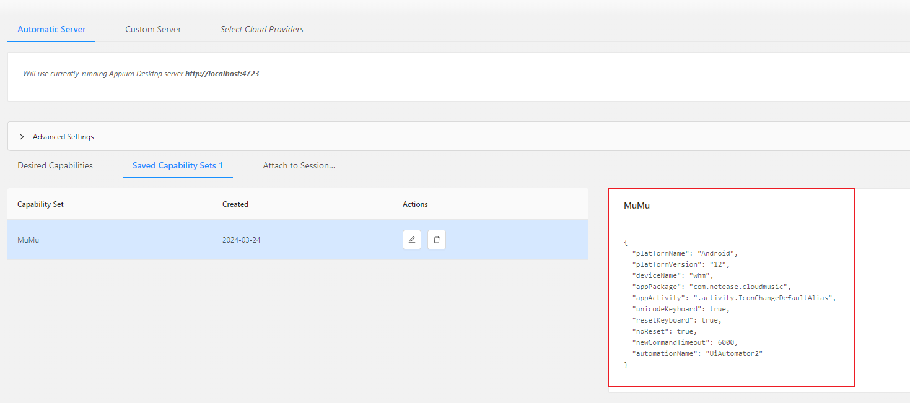

## 📌 准备工作

1. 安装Appium Server并运行
2. 安装JDK，设置环境变量
3. 安装Android SDK，设置环境变量
4. 连接Android设备，确保"USB调试"已开启
5. `pip install appium-python-client==3.2.1`，最新版(4.0.0)`import TouchAction`报错找不到模块。
6. 找到待测应用的包名及activity：

      执行`adb shell dumpsys activity recents | findstr "intent={"`，打印信息如：
      ```
      intent={act=android.intent.action.MAIN cat=[android.intent.category.LAUNCHER] flg=0x10200000 cmp=com.netease.cloudmusic/.activity.IconChangeDefaultAlias}
      intent={act=android.intent.action.MAIN cat=[android.intent.category.HOME] flg=0x10000100 cmp=com.mumu.launcher/.Launcher}
      intent={act=android.intent.action.MAIN cat=[android.intent.category.LAUNCHER] flg=0x10200000 cmp=com.android.settings/.Settings}
      ```
      其中首行的`cmp=com.netease.cloudmusic/.activity.IconChangeDefaultAlias`，

      `com.netease.cloudmusic`代表包名，

      `IconChangeDefaultAlias`代表activity。

## 📌 运行原理

1.appium需要客户端、服务端

2.底层是uiautomator2(android)/webdriveragent(ios)  
客户端通过http发送至appium服务端，再转发至uiautomator2/webdriveragent相应的驱动，驱动执行命令后返回结果至服务端。

## 📌 元素定位

两种方式：

1. 运行Android SDK目录下`./tools/bin/uiautomatorviewer.bat`
2. 运行Appium Server的`Inspector Session`，但需设置连接参数，如下图。



## 📌 快速上手

      
```python
import os

from appium.webdriver.common.touch_action import TouchAction
from appium import webdriver
from selenium.common import NoSuchElementException, TimeoutException
from selenium.webdriver.common.by import By
from appium.webdriver.extensions.android.nativekey import AndroidKey
from appium.options.android import UiAutomator2Options
from selenium.webdriver.support.wait import WebDriverWait

desired_caps = {
    'platformName': 'Android',
    'platformVersion': '12',
    'deviceName': 'whm',  # 设备名，安卓手机可以随意填写
    'appPackage': 'com.netease.cloudmusic',
    'appActivity': '.activity.IconChangeDefaultAlias',
    'unicodeKeyboard': True,  # 输入非英文的字符
    'resetKeyboard': True,  # 执行完程序恢复原来输入法
    'noReset': False,  # False表示重置App
    'newCommandTimeout': 6000,
    'automationName': 'UiAutomator2'
    # 'app': r'd:\apk\bili.apk',
}

# 连接Appium Server并初始化
driver = webdriver.Remote('http://localhost:4723/wd/hub', options=UiAutomator2Options().load_capabilities(desired_caps))

# driver.implicitly_wait(10)

# 点击两次不同意，进入“基本功能模式”
ele = WebDriverWait(driver, 10).until(lambda x: x.find_element(By.ID, value='disagree'), message=f'找不到元素')
ele.click()
ele = WebDriverWait(driver, 10).until(lambda x: x.find_element(by='id', value='disagree'), message=f'找不到元素')
ele.click()

# 点击“搜索栏”，输入“Cyberpunk 2077”
ele = WebDriverWait(driver, 10).until(lambda x: x.find_element(by='class name', value='android.widget.EditText'),
                                      message=f'找不到元素')
ele.click()
ele.send_keys('Cyberpunk 2077')
driver.press_keycode(AndroidKey.ENTER)

# 上滑直至找到歌曲：Night City
screen_size = driver.get_window_size()
width = screen_size['width']
height = screen_size['height']

# 使用相对坐标
x1 = width * 0.5
y1 = height * 0.2
# x2 = width * 0.5
y2 = height * 0.7

while True:
    try:
        ele = WebDriverWait(driver, 1).until(
            lambda x: x.find_element(By.XPATH, '//android.view.View[@text="Night City"]'))
        # ele.click()
        print("已找到目标歌曲：Night City")
        break
    except (NoSuchElementException, TimeoutException):
        # 两种滑动方式都可
        # driver.swipe(x1, y2, x1, y1, 300)
        TouchAction(driver).long_press(x=x1, y=y2).move_to(x=x1, y=y1).release().perform()

# 爬取查询结果`Night City`及以上的歌名及作者专辑信息
# /..即parent父节点
search = driver.find_elements(By.XPATH, value='//android.view.View[@text="Night City"]/../../../android.view.View')

for ele in search:
    # 这一层是歌名
    song_name = ele.find_element(By.XPATH, value='//android.view.View/android.view.View/android.view.View').text
    # 这一层是作者专辑信息
    info = ele.find_element(By.XPATH,
                            value='//android.view.View/android.view.View/android.view.View/android.view.View').text
    print("歌名：", song_name, "作者专辑信息：", info)
    if song_name == 'Night City':
        break

# 截取屏幕快照并保存至当前脚本所在目录
screenshot_file_name = "screenshot.png"
screenshot_path = os.path.join(os.path.dirname(os.path.abspath(__file__)), screenshot_file_name)
driver.get_screenshot_as_file(screenshot_path)

driver.quit()

```