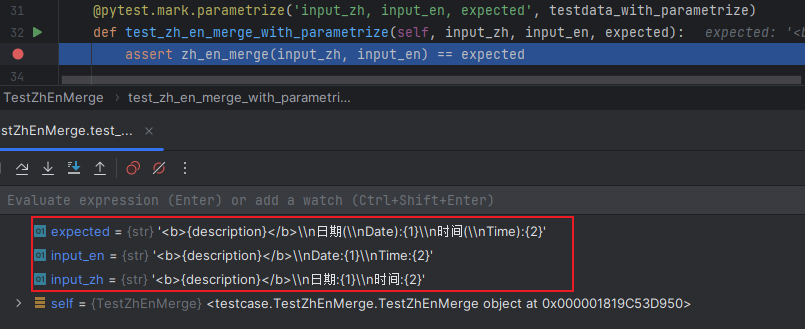

### 🚁 Fixture 作用域

当测试第一次请求时创建fixture，并根据它们的`scope`参数值销毁：

* function：默认值，函数级每个测试函数执行一次。

* class：类级别，每个测试类执行一次。

* module：模块级，每个测试模块执行一次。

* package: 包级别，每个测试包执行一次。要求testcase目录是package而非directory。

* session: 会话级，整个会话只执行一次。

### 🚁 setUp/tearDown方法

setUp/tearDown是执行测试用例的前置/后置方法，用于初始化/清理环境。继承unittest的类可直接使用同名方法。

pytest中也有[类似名称的方法](https://blog.csdn.net/qq_36502272/article/details/100671845)，也可通过`yield fixtures`
实现类似功能。

=== "conftest.py"

    ```python
    @pytest.fixture(scope='package')
    def myfunc():
        conn = dbUtils.connect()  # 数据库工具类实例
        driver = webdriver.Chrome()  # webdriver实例
        yield conn,driver
        conn.close()
        driver.quit()

    ```

=== "Testcase.py"

    ```python
    def test_case1(myfunc):
        conn, driver = myfunc
        conn.execute("select * from table")
        driver.get("http://www.baidu.com")
        assert driver.title == "百度一下，你就知道"

    ```

### 🚁 参数化

pytest参数化的方式包括：

* 使用测试夹具params参数，`return request.param`返回参数化的数据。
* 使用`pytest.mark.parametrize`装饰器。

=== "测试用例"

    ```python
    import os
    import pytest
    
    from learn.ZhEnMerge import zh_en_merge
    from utils.SomeConstant import TESTDATA_PATH
    from utils.YamlUtil import YamlUtil
    
    testdata = YamlUtil(os.path.join(TESTDATA_PATH, 'ZhEnMergeTestData.yaml')).get_yaml_data().get('zh_en_merge_testdata')
    
    
    @pytest.fixture(params=testdata)
    def param_testdata(request):
        return request.param
    
    
    class TestZhEnMerge:
    
        def test_zh_en_merge(self, param_testdata):
            input_zh = param_testdata.get('input_zh')
            input_en = param_testdata.get('input_en')
            expected = param_testdata.get('expected')
            assert zh_en_merge(input_zh, input_en) == expected
    
        # pytest参数化装饰器的传参格式为("参数1, 参数2", 列表数据如[(input1, expected1), (input2, expected2)]])
        # 转换为合适的传参格式
        testdata_for_parametrize = [(t.get('input_zh'), t.get('input_en'), t.get('expected')) for t in testdata]
    
        @pytest.mark.parametrize('input_zh, input_en, expected', testdata_for_parametrize)
        def test_zh_en_merge_with_parametrize(self, input_zh, input_en, expected):
            assert zh_en_merge(input_zh, input_en) == expected
    
    ```

=== "被测方法"

    ```python
    import re
    
    
    def zh_en_merge(cn: str, en: str) -> str:
        """
        把传入的字符串排除html字符、{}字符等，并以“中文(英文)”的格式进行拼接
        但由于语言语法问题导致结果不理想
        :param cn: 中文字符串
        :param en: 英文字符串
        :return: 合并后的字符串
        """
        # (?:...) 非捕获分组，保留匹配的内容不再匹配
        # <[^>]+> 匹配html标签
        # \{.*?\} 匹配{xxx}格式的参数
        # [^<>{}:]++ 无花括号、尖角符号、冒号的字符串
        zh_res = re.findall(r'(?:<[^>]+>|\{.*?\}|[^<>{}:]+|:)', cn)
        en_res = re.findall(r'(?:<[^>]+>|\{.*?\}|[^<>{}:]+|:)', en)
        for i in range(len(zh_res)):
            if zh_res[i].strip() != en_res[i].strip():
                zh_res[i] += f'({en_res[i].strip()})'
    
        marge_str = ''.join(zh_res)
        return marge_str
    
    ```

=== "YamlUtil.py"

    ```python
    import os
    import yaml
    
    
    # Yaml文件读取的工具类
    class YamlUtil:
        def __init__(self, file_dir):
            self.file_dir = str(file_dir)
    
        def get_yaml_data(self) -> dict:
            if os.path.exists(self.file_dir):
                data = open(self.file_dir, 'r', encoding='utf-8')
                res = yaml.load(data, Loader=yaml.FullLoader)
            else:
                raise FileNotFoundError("文件路径不存在，请检查")
            return res
    ```

=== "测试数据"

    ```yaml
    zh_en_merge_testdata:
      - input_zh: '<b>{description}</b>\n日期:{1}\n时间:{2}'
        input_en: '<b>{description}</b>\nDate:{1}\nTime:{2}'
        expected: '<b>{description}</b>\n日期(\nDate):{1}\n时间(\nTime):{2}'
      - input_zh: '支付<b>{0}</b>(<b>{1}</b> 来自国库)获取此资源。'
        input_en: 'Pay <b>{0}</b> (<b>{1}</b> in treasury) to claim this resource.'
        expected: '支付(Pay)<b>{0}</b>(<b>{1}</b> 来自国库)获取此资源。(in treasury) to claim this resource.)'
    ```

=== "运行结果"

    ```text
    TestZhEnMerge.py::TestZhEnMerge::test_zh_en_merge[param_testdata0] PASSED [ 25%]
    TestZhEnMerge.py::TestZhEnMerge::test_zh_en_merge[param_testdata1] PASSED [ 50%]
    TestZhEnMerge.py::TestZhEnMerge::test_zh_en_merge_with_parametrize[<b>{description}<\b>\n\u65e5\u671f:{1}\n\u65f6\u95f4:{2}-<b>{description}<\b>\nDate:{1}\nTime:{2}-<b>{description}<\b>\n\u65e5\u671f(\nDate):{1}\n\u65f6\u95f4(\nTime):{2}] PASSED [ 75%]
    TestZhEnMerge.py::TestZhEnMerge::test_zh_en_merge_with_parametrize[\u652f\u4ed8<b>{0}<\b>(<b>{1}<\b> \u6765\u81ea\u56fd\u5e93)\u83b7\u53d6\u6b64\u8d44\u6e90\u3002-Pay <b>{0}<\b> (<b>{1}<\b> in treasury) to claim this resource.-\u652f\u4ed8(Pay)<b>{0}<\b>(<b>{1}<\b> \u6765\u81ea\u56fd\u5e93)\u83b7\u53d6\u6b64\u8d44\u6e90\u3002(in treasury) to claim this resource.)] PASSED [100%]
    ```

!!! note "补充"

    测试用例重复执行多次  
    @pytest.mark.parametrize("iteration", range(6))


#### ❓ 关于控制台打印将汉字转为Unicode字符

从上述运行结果可以看出，使用`pytest.mark.parametrize`装饰器时，控制台打印将汉字转为了Unicode字符。

实际上各文件编码、IDE的输出编码、pytest.ini编码设置都是utf-8，且调试时也能正常解析汉字，不影响运行结果。



[解决方案](https://dandelioncloud.cn/article/details/1596087866059079681)可参考这一篇，使用pytest钩子函数，在测试项收集完成阶段处理编码问题。

!!! note "补充"

    pytest提供了大量的钩子函数，这些函数允许在测试执行的各个阶段进行定制和扩展。

参考资料：

1.[How to use fixtures](https://docs.pytest.org/en/latest/how-to/fixtures.html#how-to-fixtures)

2.[pytest hooks函数](https://docs.pytest.org/en/latest/reference/reference.html#hooks)

---

## 📌 面试题

### 🚁 pytest相比unittest的优势有哪些？请举2个你在项目中实际用到的pytest特性，并说明其应用场景。

* Fixture-夹具：用于管理测试前置/后置条件，相比`unittest`的setUp/tearDown更灵活，可以指定不同的作用域。  
在实际项目中，我用`@pytest.fixture(scope="module")`封装“启动Chrome浏览器”、实例化数据库工具类的操作，模块内的所有用例共享同个实例，减少浏览器启动次数和数据库连接次数，提升了测试效率。

* @pytest.mark.parametrize-参数化：用于测试用例参数化，批量执行相同逻辑的用例。  
在接口自动化中，我用参数化读取excel/yaml的用例数据，生成多条测试用例，避免了写重复的代码。

---