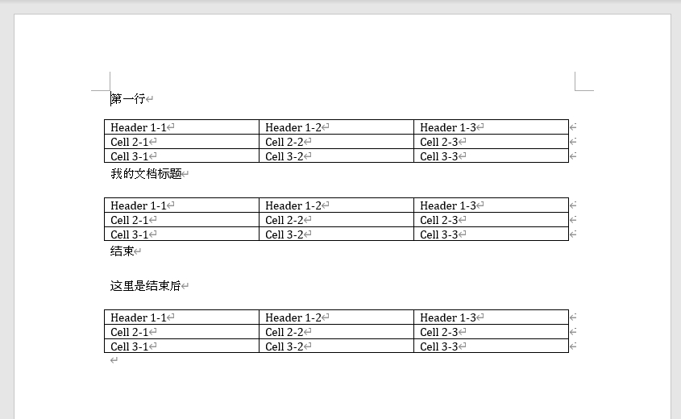

# 

### 🚁 文档内容

先建个word文档，并保存为`./output.docx`。


=== "make_doc.py"

    ```python
    from docx import Document
    from docx.shared import Inches
    
    
    def add_table(doc):
        """向word文档中添加表格"""
        table = doc.add_table(rows=3, cols=3, style='Table Grid')
        # 填充表格数据
        row_count = 0
        for row in table.rows:
            col_count = 0
            for cell in row.cells:
                if row_count == 0:  # 第一行加header
                    cell.text = f'Header {row_count + 1}-{col_count + 1}'
                else:
                    cell.text = f'Cell {row_count + 1}-{col_count + 1}'
                col_count += 1
            row_count += 1
        # 设置单元格宽度
        table.cell(0, 0).width = Inches(1.5)
        table.cell(0, 1).width = Inches(2.0)
        table.cell(0, 2).width = Inches(1.5)
    
    
    def make_doc():
        """生成word文档"""
        doc = Document()
        doc.add_paragraph('第一行')
        add_table(doc)
        doc.add_paragraph('我的文档标题')
        add_table(doc)
        doc.add_paragraph('结束')
        doc.add_paragraph('这里是结束后')
        add_table(doc)  # 验证结果是否正确
        # 保存文档
        doc.save('output.docx')
    ```

=== "生成文档的内容"

    

### 🚁 获取指定范围内的表格

=== "DocxReader.py"
    
    ```python
    class DocxReader:
        def __init__(self, file: str):
            self.document = Document(file)  # openxml
            self.paragraphs = self.document.paragraphs
            self.all_tables = self.document.tables
    
        def get_table_by_sections(self, start_str: str, end_str='') -> dict:
            """
            获取docx文件中指定范围的所有表格id，并取表格上一行文本作为表名
            :param start_str: 起始行文本，精准匹配
            :param end_str: 结束行文本，精准匹配；无传参时从start_str下方开始查找最近的表格id
            :return: {tableid:tablename,}
            """
            find_tbls = {}
            # 获取指定范围的所有表格ele，存储为{ele:表名}格式字典
            for aPara in self.paragraphs:
                if aPara.text == start_str:
                    ele = aPara._p
                    if end_str:
                        # 当end_str非空时，遍历start_str至end_str章节内所有表格id
                        while ele.text != end_str:
                            ele = ele.getnext()
                            if ele.tag[-3:] == 'tbl':
                                _ = ele.getprevious().text  # 取表格上一行文本作为表名
                            find_tbls[ele] = _
                    else:
                        # 当end_str为空时，从start_str下方开始查找最近的表格id
                        while ele.tag[-3:] != 'tbl':
                            ele = ele.getnext()
                        _ = ele.getprevious().text  # 取表格上一行文本作为表名
                        find_tbls[ele] = _
                    break
            return find_tbls
    
        def get_sepcified_table_content(self, start_str: str, end_str='') -> dict:
            """
            获取docx文件中指定表格内容
            :param start_str: 起始行文本，精准匹配
            :param end_str: 结束行文本，精准匹配；无传参时从start_str下方开始查找最近的表格id
            :return: {tablename:[ (content[0]),(content[1]) ... ],}
            """
            find_tbls = self.get_table_by_sections(start_str=start_str, end_str=end_str)
            res = {}
            # 所有表格遍历，进行匹配存储为{表名:[(第n行内容)]}格式字典
            for table in self.all_tables:
                if table._tbl in find_tbls.keys():
                    tmp = find_tbls.get(table._tbl)
                    res_table = []
                    for row in table.rows:
                        res_row = tuple(col.text for col in row.cells)
                        res_table.append(res_row)
                    res[tmp] = res_table
            return res
    
    
    if __name__ == '__main__':
        make_doc()  # 生成文件至./output.docx
        dr = DocxReader('output.docx')
        res = dr.get_sepcified_table_content('第一行', '结束')
        for k, v in res.items():
            print(f'表名：{k}\n表内容：{v}\n')
        res = dr.get_sepcified_table_content_with_th('结束')
        for k, v in res.items():
            print(f'表名：{k}\n表内容：{v}\n')
    
    ```

=== "运行结果"

    ```
    表名：第一行  
    表内容：[('Header 1-1', 'Header 1-2', 'Header 1-3'), ('Cell 2-1', 'Cell 2-2', 'Cell 2-3'), ('Cell 3-1', 'Cell 3-2', 'Cell 3-3')]
    
    表名：我的文档标题  
    表内容：[('Header 1-1', 'Header 1-2', 'Header 1-3'), ('Cell 2-1', 'Cell 2-2', 'Cell 2-3'), ('Cell 3-1', 'Cell 3-2', 'Cell 3-3')]
    
    表名：这里是结束后  
    表内容：[('Header 1-1', 'Header 1-2', 'Header 1-3'), ('Cell 2-1', 'Cell 2-2', 'Cell 2-3'), ('Cell 3-1', 'Cell 3-2', 'Cell 3-3')]
    
    ```

[参考的这一篇博客](https://blog.csdn.net/chelseady/article/details/102689683)

---
最后更新: 2024/02/02 15:24