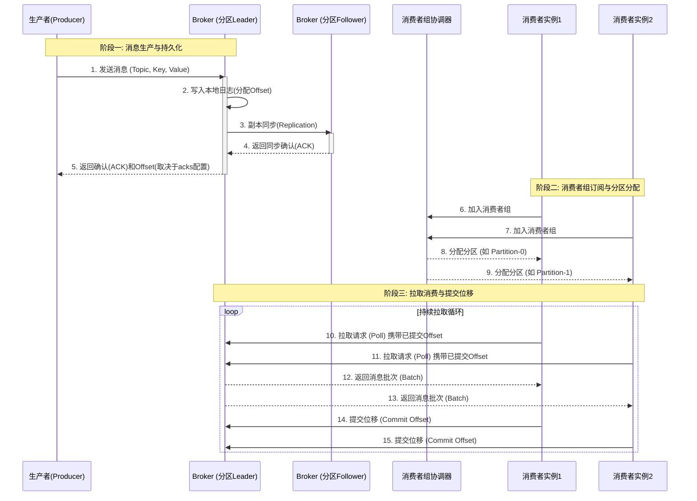

## 基本概念

- 消息（Record）: Key-Value 二进制数据，可带时间戳和 Headers。
- 主题（Topic）: 消息的逻辑分类（类似数据库的“表”）。
- 分区（Partition）: Topic 的物理分片（有序、不可变日志），**分区内有序，全局无序**。
- 偏移量（Offset）: 分区内每条消息的唯一序号（由 Broker 分配，不可变）。
- Lag（消费滞后）: 衡量消费者健康度的核心指标，公式: Lag = 生产者最大Offset - 消费者当前Offset。
- 生产者（Producer）: 发送消息，可指定分区策略（轮询、哈希 Key、自定义）。
- 消费者（Consumer）: 拉取（Pull）消息，记录消费进度（Offset）。
- 消费者组（Consumer Group）: 核心并发机制。**组内每个分区只能被一个消费者消费**，组内成员（消费者）数建议等于分区数。
- Broker（代理节点）: Kafka 服务进程，一个集群由多个 Broker 组成。
- 副本（Replica）: 分区的冗余备份。Leader 负责读写，Follower 负责同步（ISR 机制），保障高可用。
- ISR（同步副本集）: 与 Leader 保持同步的 Follower 集合，只有 ISR 内的副本才能被选为新 Leader。

!!! tip "关于 Leader 和 Follower "

    - 生产者/消费者都只跟 Leader 交互，Follower 只负责同步数据，不负责读写（除非特意配置读 Follower 降级，可解决跨机房网络延迟问题）。
    - Follower: 只是一个“热备份硬盘”，除了复制数据和等待接班，平时处于“闲置”状态。

---

## 消息传递流程

如图的提交位移是最安全、最推荐的“手动同步提交”姿势（处理完成后提交）。

??? note "提交模式"

    | 提交模式 | 配置/代码 | 提交时机 | 风险 |
    | :--- | :--- | :--- | :--- |
    | 自动提交（默认） | `enable.auto.commit=true` | Broker 返回消息给消费者的瞬间（拉取完成），后台定时线程（默认每 5 秒）自动提交当前拉取的最大 Offset | 丢数据风险极高: 如果如图 12/13 返回数据后，业务逻辑（处理）报错崩溃，但 Offset 早已提前提交，重启后消息就永远丢失了。 |
    | 手动同步提交 | `commitSync()` | 严格在 12/13 返回消息批次之后，且必须在业务处理成功之后。即: 拉取数据 -> 业务入库/计算 -> 最后才调用 commit。 | 可能会重复消费（At-least-once），但绝不会丢数据，这是最常用的保障。 |
    | 手动异步提交 | `commitAsync()` | 同样在业务处理后调用，但不等 Broker 返回确认，立即继续拉取下一批。 | 吞吐量最高，但如果提交失败，且没有重试机制，重启后会有少量重复。 |



---

## Rebalance-分区重分配

目标: 确保消费者组内，每个分区最终只被一个消费者持有，且整体负载尽量均衡。

### 触发时机

- 消费者数量变化: 新增消费者实例，或 Broker 认为该消费者已挂掉（如消费者超过`max.poll.interval.ms`没有调用 poll() 方法），强制将其踢出消费者组。
- 分区数量变化: 管理员手动增加 Topic 的分区数（Partition 扩容）。
- 订阅关系变化: 消费者订阅的正则表达式（如 topic-*）匹配到新创建的 Topic 。

### 代价

- 消费暂停（STW）: 全量或部分分区停止拉取消息，系统实时性下降。
- 重复消费（Re-processing）: 因为位移（Offset）还没来得及提交，分区被分配给新消费者后，新消费者会从上一个已提交的位移重新拉取，导致大量消息被重复处理一遍。
- 操作不当加剧Lag（参考如下案例）: 暂停的时间越长，积压的消息越多，处理越慢，更容易因超时被踢出 Group，导致恶性循环。

### 参数及调优

- max.poll.interval.ms（默认5分钟）: 最关键，消费者两次 poll() 拉取的最大间隔。若超时会被强制踢出 Group 引发 Rebalance。需要根据业务耗时调大此值（比如 30 分钟），同时配合减少 max.poll.records（单次拉取条数）。
- session.timeout.ms（默认45秒）: Broker 判定消费者死亡的最长时间。如果网络抖动，调大此值（如 60秒）可防止误判踢人。
- heartbeat.interval.ms（默认3秒）: 消费者向 Coordinator 发送心跳的频率。必须小于 session.timeout.ms 的 1/3，保证 Coordinator 能及时感知存活状态。

### 案例

当消费者提交 Offset 的速度很慢，Lag 很大，此时恰好发生 Rebalance（分区重分配），这会导致消费延迟进一步雪崩。

错误做法: 只增加消费者实例，而没有增加分区数。

**组内每个分区只能被一个消费者消费**，新增的消费者空闲，原消费者依然扛着全量流量。

1. 消费者数量变化触发 Rebalance，消费暂停（STW）；同时生产者继续往 Broker 写数据，Lag 不降反升。
2. 重平衡结束后，每个消费者分到了新的分区，但负载压力更大，处理这批消息耗时极长。
3. 由于超时未调用 poll() 方法，Broker 认为该消费者已挂掉，强制将其踢出消费者组，随之立即触发又一次新的 Rebalance。

正确做法: 同时扩容分区数（先加分区）和消费者实例。

#### 扩容副作用

- **分区内有序，全局无序**，因此扩容后，消息顺序性必然受影响。
- 分区数越多，Broker 内存中维护的元数据越多，Controller 选举开销越大，且日志段（LogSegment）文件增多，磁盘 I/O 可能抖动。
- 扩容必然伴随 Rebalance，导致消费暂停（STW）和重复消费（Re-processing）。

---

## Broker

- 消息队列集群中的一个服务节点，负责接收生产者发送的消息、写入磁盘(持久化)、管理消息分区、以及响应消费者的拉取请求。
- 在 Kafka 中，一个 Broker 就是一个 Kafka 服务进程(一台机器或一个容器)。多个 Broker 组成集群。
- 相当于物流分拨中心

### Q: 如果只有一个 Broker，挂了怎么办？

A: 导致消息丢失或不可用。所以生产环境至少 3 个 Broker，并配置 replication-factor=3，保证即使一个 Broker 宕机，其他 Broker 上的副本仍可提供服务。

### Q: Broker 和 Topic、Partition 的关系？

A: 每个 Partition 只能存在于一个 Broker 上(但可以有多个副本分布在不同 Broker)。多个 Partition 分布在多个 Broker 上，实现并行读写。

## Offset

偏移量: 消息在分区内的唯一序号，从0递增，用于标识消息在分区中的位置。

验证堆积: 

```shell
# 查看old-topic的offset
docker exec kafka kafka-run-class kafka.tools.GetOffsetShell --bootstrap-server localhost:9092 --topic old-topic --time -1
```

- -time -1 表示获取最新(latest)的 offset，即该分区当前下一条待写入消息的 offset 值(也是分区中消息的总条数)。
- -time -2 表示获取最早 offset(分区第一条消息)
- -time 0 或其他时间戳 表示获取小于等于该时间戳的最大 offset

### 幂等

收到消息 → Redis SISMEMBER 查询 → 存在则丢弃，不存在则处理 → 处理后写入Redis

幂等检查预设的异常场景: 

- Kafka 消费者重启，未提交 offset
- 网络抖动导致消费成功但提交 offset 失败
- 手动重放 Topic 中的消息	
