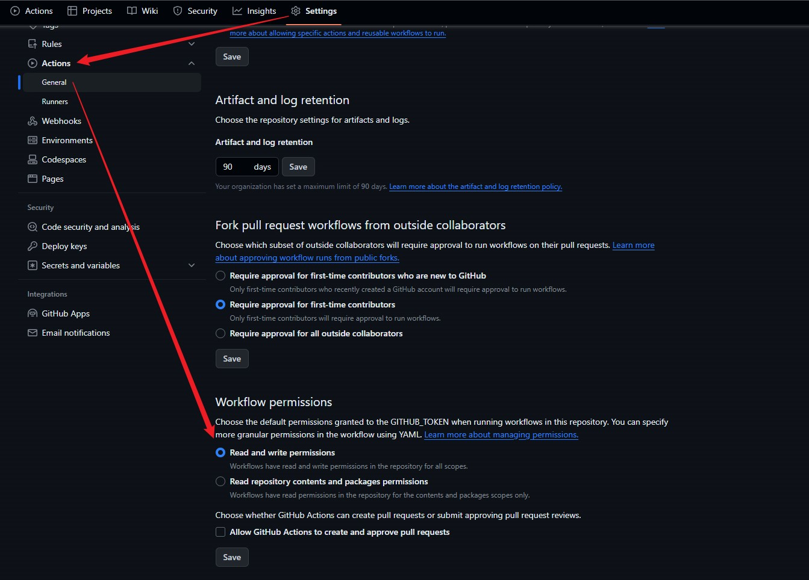

mkdocs：基于Python的文档生成工具，用于快速、简单的生成网站。

## 📌 mkdocs常用命令

|            命令             | 说明                          |
|:-------------------------:|:----------------------------|
|       `mkdocs new`        | 生成站点目录及配置文件；如已经有相同的目录可以不用执行 |
| `mkdocs serve -a ip:port` | 在本地运行，预览生成的html；默认8000端口    |
|      `mkdocs build`       | md转html文件，生成的文件在./site目录下   |

!!! note "补充"

    需要先cd至存放mkdocs.yml的目录


## 📌 Material for MkDocs

[点击这里跳转至官方使用文档](https://squidfunk.github.io/mkdocs-material/getting-started/)

mkcocs-material是mkdocs的主题之一 ，在mkdocs.yml中配置。下列是可能有用的组件示例。

mkdocs编写的文档提交到github后，可以通过github action[部署到github page](#github-page)。


### 🚁 带tab页的代码块

=== "预览"

    ``` c++
    #include <iostream>

    int main(void) {
      std::cout << "Hello world!" << std::endl;
      return 0;
    }
    ```

=== "mkdocs.yml配置"

    ```yaml
    markdown_extensions:
        # 可切换tab页的代码块扩展
        - pymdownx.superfences
        - pymdownx.tabbed:
            alternate_style: true
    ```

=== "code.md"

    ```
    === "Hello world!"

        ``` c++
        #include <iostream>
    
        int main(void) {
          std::cout << "Hello world!" << std::endl;
          return 0;
        }
        ```
    ```


### 🚁 带tab页的提示框

!!! example "示例"

    === "示例1-无序列表"

        ``` markdown
        * Sed sagittis eleifend rutrum
        * Donec vitae suscipit est
        * Nulla tempor lobortis orci
        ```

    === "示例2-无序列表"

        ``` markdown
        1. Sed sagittis eleifend rutrum
        2. Donec vitae suscipit est
        3. Nulla tempor lobortis orci
        ```

    === "mkdocs.yml配置"

        ```yaml
        markdown_extensions:
            # 可切换tab页的代码块扩展
            - pymdownx.superfences
            - pymdownx.tabbed:
                alternate_style: true
            # 提示框扩展
            - admonition
            - pymdownx.details
            - pymdownx.superfences
        ```

    === "code.md"

        ```
        !!! example "示例"

            === "示例1-无序列表"
        
                ``` markdown
                * Sed sagittis eleifend rutrum
                * Donec vitae suscipit est
                * Nulla tempor lobortis orci
                ```
        
            === "示例2-无序列表"
        
                ``` markdown
                1. Sed sagittis eleifend rutrum
                2. Donec vitae suscipit est
                3. Nulla tempor lobortis orci
                ```
        ```


### 🚁 默认折叠展示的提示框

??? question "示例"

    === "示例"

        提示框类型还有note、tip、success、fail、question、warning等。

        > 参考资料：[mkdocs-material官方使用文档示例](https://squidfunk.github.io/mkdocs-material/reference/admonitions/#admonition-icons-fontawesome)
         
    === "code.md"

        ```
        ??? question

            提示框类型还有note、tip、success、fail、question、warning等。
        ```


### 🚁 正文中使用emoji表情

=== "示例"

    :heart:
    :smile:
    :laughing:
    :blush:
    :smiley:
    :relaxed:
    :smirk:
    :heart_eyes:
    :kissing_heart:
    :kissing_closed_eyes:
    :flushed:
    :relieved:
    :satisfied:
    :grin:
    :wink:

    [官网使用文档](https://squidfunk.github.io/mkdocs-material/reference/icons-emojis/#search)
    提供了图标、emoji表情的搜索功能

=== "mkdocs.yml配置"

    ```yaml
    markdown_extensions:
    # emoji等图标的扩展
    - attr_list
    - pymdownx.emoji:
        emoji_index: !!python/name:material.extensions.emoji.twemoji
        emoji_generator: !!python/name:material.extensions.emoji.to_svg
    ```

=== "code.md"

    ```markdown
    :heart:
    :smile:
    :laughing:
    :blush:
    :smiley:
    :relaxed:
    :smirk:
    :heart_eyes:
    :kissing_heart:
    :kissing_closed_eyes:
    :flushed:
    :relieved:
    :satisfied:
    :grin:
    :wink:
    ```


## 📌 部署到github page

1.项目根目录下建./github/workflows/xxx.yml文件，定义工作流，表示持续集成执行的任务。内容如下：

```yaml
name: blog_ci
on:
  push:
    branches:
      - master
      - main
jobs:
  deploy:
    runs-on: ubuntu-latest
    steps:
      - name: Checkout master
        uses: actions/checkout@v2
        with:
          fetch-depth: 0  # 默认为1，只取最近的1个提交，导致无法获取到每个文件的最后修改时间

      - name: Set up Python3.x
        uses: actions/setup-python@v2
        with:
          python-version: 3.x

      - run: pip install mkdocs
      - run: pip install mkdocs-material
      - run: pip install mkdocs-glightbox
      - run: pip install jieba
      - run: pip install mkdocs-git-revision-date-localized-plugin

      - name: Deploy
        run: mkdocs gh-deploy --force
```

2.在GitHub仓库页，进入路径：`Settings`->`Actions`->`General` ，

将`Workflow Permissions`设置为`Read an write permissions`，点击`Save`保存。



3.之后push代码时便会触发工作流，运行成功后访问`https://{username}.github.io`即可查看。

> 参考资料：[Quickstart for GitHub Actions](https://docs.github.com/en/actions/quickstart)

---

## 📌 关于mermaid

### 第三方插件

`mkdocs-mermaid2-plugin`，有时需要刷新才能展示mermaid对应图表，且无法与`panzoom`配合放大。

### 原版自带

有些图表渲染不对，搭配`@mermaid-js/layout-elk`可能可规避。

Supported layouts

- `elk`: The default layout, which is `elk.layered`.
- `elk.layered`: Layered layout
- `elk.stress`: Stress layout
- `elk.force`: Force layout
- `elk.mrtree`: Multi-root tree layout
- `elk.sporeOverlap`: Spore overlap layout

实在不行用[Mermaid Live Editor](https://mermaid.ai/live)，在线编辑（支持拖放）后保存图片；另外，`"theme": "redux"`这主题好看。

> 参考资料

> 1. [ELK Layout](https://www.npmjs.com/package/@mermaid-js/layout-elk)
> 2. [mkdocs-material customize Mermaid.js](https://squidfunk.github.io/mkdocs-material/reference/diagrams/?h=mermaid#customization)

---