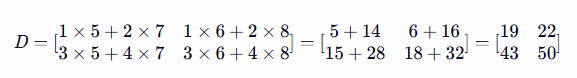

续day02，继续numpy的内容。

## 📌 线性代数

### 🚁 矩阵乘法

`np.dot`: 主要用于计算两个数组的点积。对于二维数组，np.dot 等价于矩阵乘法。

`np.matmul`: 专门用于矩阵乘法，支持多维数组的矩阵乘法。

=== "二维矩阵乘法"

    ```python
    import numpy as np
    
    # 2x2矩阵
    A = np.array([[1, 2], [3, 4]])
    B = np.array([[5, 6], [7, 8]])
    
    D = np.dot(A, B)
    print(D)
    # [[19 22]
    #  [43 50]]

    ```

=== "运算过程"

    

### 🚁 矩阵的逆和行列式

np.linalg.inv(A)  
计算矩阵的逆

np.linalg.det(A)  
计算行列式

### 🚁 解线性方程组

给定系数矩阵A和常数项b，求解线性方程组`Ax = b`。

```python
import numpy as np

# 定义矩阵A和向量b
A = np.array([[2, 1], [1, 3]])
b = np.array([9, 8])

# 解线性方程组
x = np.linalg.solve(A, b)
print("线性方程组的解:")
print(x)  # [3.8 1.4]
```

### 🚁 协方差矩阵

* 方差-波动程度，正相关（协方差矩阵的对角线元素）。
* 协方差-矩阵间的关系：协方差为正数时，表示矩阵正相关；趋近于0时，则表示几乎不相关。
* 特征值和特征向量，用于主成分分析（PCA），识别数据的主要成份及方向。

=== "从收益率计算股票间的关系"

    ```python
    import numpy as np
    
    # 三只股票的收益率矩阵（3行1000列）
    stock_returns = np.array([
        np.random.normal(0.0005, 0.02, 1000),
        np.random.normal(0.0003, 0.015, 1000),
        np.random.normal(0.0007, 0.025, 1000)
    ])
    
    # 计算协方差矩阵
    # 协方差矩阵描述了以上三只股票收益率之间的相关性（线性关系）
    cov_matrix = np.cov(stock_returns)
    
    # 提取方差（协方差矩阵的对角线元素）
    # 方差-波动程度，正相关
    variances = np.diag(cov_matrix)
    
    # 提取协方差（协方差矩阵的非对角线元素）
    # 协方差-两只股票收益率间的关系：协方差为正数时，表示两只股票收益率正相关；趋近于0时，则表示几乎不相关
    covariances = cov_matrix - np.diag(np.diag(cov_matrix))
    
    # 设置打印选项，抑制科学计数法，设置为小数点后6位
    np.set_printoptions(suppress=True, precision=6)
    
    print("协方差矩阵:\n", cov_matrix)
    print("方差:\n", variances)
    print("协方差:\n", covariances)
    
    # 提取特定协方差值
    cov_12 = covariances[0, 1]
    cov_13 = covariances[0, 2]
    cov_23 = covariances[1, 2]
    
    print(f"第一只股票和第二只股票的协方差:{cov_12:6f}")
    print(f"第一只股票和第三只股票的协方差:{cov_13:6f}")
    print(f"第二只股票和第三只股票的协方差:{cov_23:6f}")
    
    # 计算特征值和特征向量，用于主成分分析（PCA），识别数据的主要成份及方向。
    eigenvalues, eigenvectors = np.linalg.eig(cov_matrix)
    
    print("特征值:\n", eigenvalues)  # 特征值越大，风险程度越高
    print("特征向量:\n", eigenvectors)
    
    ```

!!! note "补充"

    方差是每个样本值与全体样本值的平均数之差的平方值的平均数。
    
    标准差则是方差的平方根。由于方差是数据的平方，与检测值本身相差太大，人们难以直观的衡量，所以常用方差开根号换算回来，即标准差。

## 📌 高性能函数

### 🚁 np.where

向量化版本的三元表达式，其基本语法如下：

`numpy.where(condition[, x, y])`

`condition`即条件表达式，当返回True时，选择`x`，否则选择`y`。

```python
import numpy as np

tmp = np.array([1, -2, 3, 4, -5, 6, 7, 8, 9, 10])
_ = np.where(tmp < 0, 0, tmp)
print(_)  # [ 1  0  3  4  0  6  7  8  9 10]

```

### 🚁 np.select

根据多个条件选择元素，适用于需要根据多个条件进行选择的情况。其基本语法如下：

`numpy.select(condlist, choicelist, default=0)`

`condlist`是条件表达式列表，返回True时从`choicelist`数组列表中取对应值。

要求: 所有条件数组必须具有相同的形状或能够广播到相同的形状。

=== "示例"

    ```python
    import numpy as np
    
    arr = np.array([1, -2, 3, 4, -5, 6, 7, 8, 9, 10])
    print("单条件:", arr[arr > 0])  # [ 1  3  4  6  7  8  9 10]
    
    # 定义多个条件和对应的选择
    conditions = [arr < 3, arr > 7]
    choices = [0, 99]
    
    # 遍历数组arr，小于3时取choices[0]，大于7时取choices[1]，其他情况保持不变
    arr_modified = np.select(conditions, choices, default=arr)
    print("修改后的数组:", arr_modified)  # [ 0  0  3  4  0  6  7 99 99 99]
    
    ```

=== "select+广播"

    ```python
    import numpy as np
    
    # 创建一个随机数组
    arr = np.random.randint(0, 10, size=(3, 4))
    print("原始数组:\n", arr)
    
    # 定义多个条件和对应的选择
    conditions = [arr < 3, arr > 7]
    
    # 定义选择的值，具有不同的形状
    choices = [
        np.zeros((3, 1)),  # 当条件1为真时选择 0，形状为 (3, 1)
        np.full((1, 4), 99)  # 当条件2为真时选择 99，形状为 (1, 4)
    ]
    
    # 使用 np.select 进行选择
    arr_modified = np.select(conditions, choices, default=arr)
    print("修改后的数组:\n", arr_modified)
    
    ```

### 🚁 np.percentile

`np.percentile(arr, [25, 50, 75])`

计算数组的百分位数，百分位数是统计学中用于描述数据分布的一种方法。它表示数据集中某个百分比的数据点所处的位置，帮助识别数据的分布和异常值。

常见的百分位数：

* 第25百分位数，也称为第一四分位数（First Quartile）。表示数据集中至少有 25% 的数据点小于或等于该值。

* 第50百分位数，也称为中位数（Median）。表示数据集中至少有 50% 的数据点小于或等于该值。

* 第75百分位数，也称为第三四分位数（Third Quartile）。表示数据集中至少有 75% 的数据点小于或等于该值。

### 🚁 傅里叶变换

将信号从时域转换到频域，便于分析信号的频率成分。

numpy中使用快速傅里叶变换 (FFT): 是傅里叶变换的高效算法，能够显著减少计算时间。

观察频域信号图，峰值对应的频率通常被认为是信号的主导频率。在金融领域，这些频率可能对应于不同的市场周期或趋势。

（todo：如何识别周期或趋势）

```python
import numpy as np
import matplotlib.pyplot as plt

noise_signal = np.random.normal(0.0007, 0.025, 1000)

# 创建时间向量
t = np.linspace(0, 1, 1000, endpoint=False)

# 快速傅里叶变换
fft_result = np.fft.fft(noise_signal)
frequencies = np.fft.fftfreq(noise_signal.size, d=t[1] - t[0])

# 设置中文字体
plt.rcParams['font.sans-serif'] = ['SimHei']  # 使用黑体
plt.rcParams['axes.unicode_minus'] = False  # 解决负号显示问题

# 绘制时域信号
plt.figure(figsize=(12, 6))
plt.subplot(2, 1, 1)
plt.plot(t, noise_signal)
plt.title('时域信号')
plt.xlabel('时间')
plt.ylabel('幅度')

# 绘制频域信号
plt.subplot(2, 1, 2)
plt.plot(frequencies[:len(frequencies) // 2], np.abs(fft_result[:len(fft_result) // 2]))
plt.title('频域信号')
plt.xlabel('频率')
plt.ylabel('幅度')
plt.xlim(0, 20)  # 限制频率范围以便观察
plt.tight_layout()
plt.show()

```