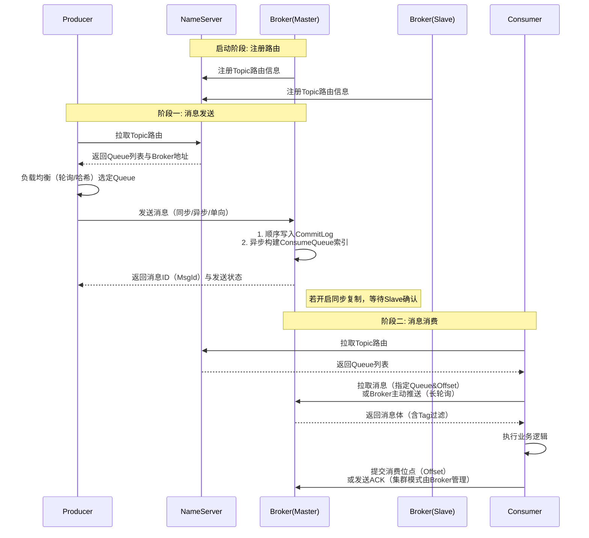

## 基本概念

- NameServer（命名服务）: 轻量级路由中心，无状态。Broker启动时向其注册，Producer/Consumer启动时从其拉取最新的路由信息（Topic与Broker的映射）。
- Broker（消息代理）: 核心消息存储与转发节点。Master处理读写请求，Slave仅同步Master数据，提供高可用。
- Topic（主题）: 逻辑上的消息集合。生产者在发送时必须指定Topic。
- MessageQueue（消息队列）: Topic下的物理分区，顺序写入、并发读取。RocketMQ的并发吞吐量由Queue数量决定，**一个Queue同一时刻只能被同一个Consumer Group内的一个消费者实例占用**。
- Tag（标签）: 二级过滤标签，方便Consumer根据业务只订阅感兴趣的数据（如订单Topic下的“付款成功”Tag）。
- ProducerGroup（生产者组）: 同一类生产者的集合。事务消息中，若生产者宕机，Broker会回调组内其他实例进行状态回查。
- ConsumerGroup（消费者组）: 同一类消费者的集合。组内消费者分摊Queue消费（集群模式），组间互不干扰。
- Offset（消费位点）: 由Broker（服务端）管理。集群模式下，Group内的每个Queue的消费进度存储在Broker，重启不丢进度。

!!! tip "消费者扩容"

    特性: 一个Queue同一时刻只能被同一个Consumer Group内的一个消费者实例占用。
    
    因此，与Kafka类似，扩容消费者实例的同时需要扩容Queue数量（新建Topic分区），但要注意，动态增加Queue会导致顺序消息乱序。

## 消息传递流程

- 启动时，Broker向NameServer注册路由
- 发送时，Producer拉取路由，根据负载均衡选一个Queue，将消息顺序追加到CommitLog
- 消费时，Consumer拉取路由，通过Queue索引拉取消息，处理完成后提交Offset

## 存储与高可用

- 存储结构: 所有消息顺序写入一个物理文件（CommitLog），再异步生成ConsumeQueue（逻辑索引）。这种设计保证了极高的写入吞吐量（远超随机写）。
- 高可用模式
  - 同步复制: Master收到消息后等待Slave写入成功才返回ACK（数据0丢失，但延迟稍高）。
  - 异步复制: Master写入本地即返回ACK（性能极高，异常时可能极少量丢失）。

## 与Kafka对比

### 1.路由发现

RocketMQ: 自研的NameServer，极简的KV存储，无选主逻辑，Broker定时心跳上报。无状态，挂了一台不影响整体路由，部署极其轻量。

Kafka: 依赖ZK或KRaft，维护Controller节点进行Leader选举和集群元数据管理。一旦Controller发生Rebalance，集群会有短暂“不可用”震荡。

结论: RocketMQ去掉了复杂的“共识算法”依赖，牺牲了部分集群自动弹性能力，换来了极致的稳定性和运维友好性。

### 2.队列分配

RocketMQ: 队列数量固定，消费者启动时采用“平均分配”（类似插槽），分配完即固定。新消费者加入或宕机，需停止所有消费者再重平衡（或等待30秒），即“先停再分”。

Kafka: 动态重平衡（Rebalance）。新消费者加入/退出时，消费者组内部“抢着认领”分区，过程中会中断消费（Stop-The-World），但支持分区数动态增加。

结论: RocketMQ牺牲了分区的动态伸缩灵活性，换来了极低的重平衡复杂度和性能开销（避免了Kafka常见的Rebalance风暴）。

### 3.消息确认

RocketMQ: 消费成功后由Broker服务端统一管理Offset（位点），客户端只需发送ACK请求即可。模型清晰，像“取件码”取快递。

Kafka: Offset由消费者客户端自行提交（自动/手动），且支持“至少一次”或“精确一次”的复杂语义，依赖事务日志。

结论: RocketMQ把复杂逻辑收归服务端，消费者变得更“傻”更轻量，消息状态管理极其透明。

### 4.存储设计

Kafka为了吞吐，依赖零拷贝和批量压缩，对PageCache极度依赖。

RocketMQ同样支持零拷贝，但为了支持任意时间的消息回溯和事务消息，在CommitLog基础上维护了更复杂的索引逻辑。

适用场景: Kafka的复杂是为了支撑数仓、海量日志（TB级）和流式计算（Flink）；RocketMQ的简单是为了保障金融级交易（如订单、库存）的绝对有序和可靠性，延迟抖动远小于Kafka。

### 5.死信队列DLQ

RocketMQ默认允许重试 16 次（延迟时间递进：10秒、30秒、1分钟、2分钟... 直到2小时），若重试全部失败，这条消息就会被Broker移入DLQ（命名自动生成，如`%DLQ%{ConsumerGroup}`）。

Kafka内置没有DLQ，可通过专用topic实现死信队列。