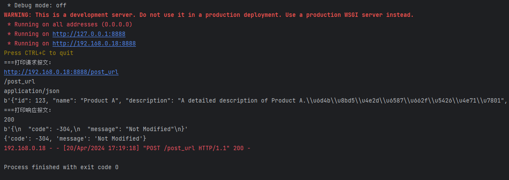

## 📌 实现

使用Flask收发请求，以下代码实现如下接口：

* `http://127.0.0.1:8888/`，通过jinja2模板渲染返回html页面。
* `http://127.0.0.1:8888/post_url`，发送post请求即可返回预设的响应数据。
* `http://127.0.0.1:8888/ping?address=baidu.com`，get请求，将传入的地址进行ping测试，返回结果。

=== "flask_util.py"

    ```python
    import json
    import os
    import shlex
    import time
    import xml
    
    from flask import Flask, Response, request, render_template
    
    app = Flask(__name__, static_folder="./", template_folder="./")  # __name__作为主程序执行
    # 延迟响应开关和超时时间
    TIMEOUT_SWITCH = False
    TIMEOUT_SECONDS = 2
    
    
    @app.before_request
    def before_request():
        print("===打印请求报文：")
        print(request.url)
        print(request.path)  # 请求路径
        print(request.mimetype)
        print(request.data)
        # print(request.get_json()) 非json报文会报415
        # print(request.method)
        # print(request.headers)
        # print(request.args)  # 如get请求的参数列表
        # print(request.form)  # 如post请求中的表单数据
        # print(request.files) # 上传的文件
        # print(request.mimetype) # 请求数据的类型
        if TIMEOUT_SWITCH:
            time.sleep(TIMEOUT_SECONDS)
    
    
    @app.after_request
    def after_request(response):
        print("===打印响应报文：")
        print(response.status_code)
        print(response.data)
        # print(response.headers)
        return response
    
    
    @app.route('/post_url', methods=['POST'])  # methods默认为'get'
    def check():
        if request.mimetype == 'application/json':
    
            # 获取预设的响应结果
            with open('response.json', 'r', encoding='utf-8') as f:
                api_res = json.load(f)
                f.close()
            # todo，报文做截取后分段入库
            api_re = request.get_json()
    
            return json.dumps(api_res, ensure_ascii=False, indent=2)
        elif request.mimetype == 'application/xml' or request.mimetype == 'text/xml':
            # 获取xml请求体信息
            xml_data = request.data
            # 解析为DOM对象
            dom = xml.dom.minidom.parseString(xml_data)
            # 获取预设的响应结果
            api_response = xml.dom.minidom.parse('response.xml').toprettyxml(indent="", newl="")
            api_response = Response(api_response, mimetype='text/xml')
            # todo，报文做截取后分段入库
            # 格式化
            api_re = dom.toprettyxml(indent="", newl="")
    
            return api_response
        elif request.mimetype == ' text/plain':
            pass
        else:
            return f'error:{request.mimetype}该报文格式暂不支持'.encode('GBK')
    
    
    @app.route('/')
    def hello():
        # 示例数据，将在模板中使用
        products = [
            {"id": 1, "name": "Product A", "price": 9.99},
            {"id": 2, "name": "Product B", "price": 19.99},
            {"id": 3, "name": "Product C", "price": 29.99}
        ]
        return render_template('index.html', products=products)
    
    
    @app.route('/ping')
    def ping():
        address = shlex.quote(request.args.get('address'))  # 使用shlex.quote()函数将字符串转义，防止命令注入
        # cmd = f"ping -c 1 {address}"  # -c 1代表只ping一次，需要具有管理权限
        cmd = f"ping {address}"
        res = os.popen(cmd)
        return f'200：{res.read()}'
    
    
    if __name__ == '__main__':
        app.run(host='0.0.0.0', port=8888, debug=True)
    
    ```

=== "response.json"

    ```json
    {"code":-304,"message":"Not Modified"}
    
    ```

=== "index.html"

    ```html
    <!DOCTYPE html>
    <html lang="en">
    <head>
        <meta charset="UTF-8">
        <meta name="viewport" content="width=device-width, initial-scale=1.0">
        <title>index</title>
    </head>
    <body>
        <h1>Product List</h1>
        <ul>
            
                <li>
                    <strong>{{ product.name }}</strong>: ${{ product.price }}
                </li>
            
        </ul>
    </body>
    </html>
    
    ```

## 📌 运行

除了上述`app.run()`运行外，还可通过多线程的方式启动，以配合其他应用运行。

### 🚁 多线程+命令行

=== "flask_util.py"

    ```python
    import os
    import socket
    
    class FlaskCmd(object):
        
        """
        # cmd手动启动Flask的指令：
        指令详情可通过：flask --help
        set FLASK_APP=flask_util.py
        set FLASK_ENV=development
        flask run -h 0,0,0,0 -p 8888 --extra-files {存放flask_util的目录} --no-debug --no-reload
        """

        __obj = None
        
        @staticmethod
        def __new__(cls, *args, **kwargs):
            if not cls.__obj:
                cls.__obj = super().__new__(cls)
            return cls.__obj

        def __init__(self):
            self._flask_app = os.path.abspath(__file__)
            self._utils_path = os.path.dirname(self._flask_app)
            
        def run_flask_sub(self, host='0.0.0.0', port=8888):
            # 设置FLASK的环境变量，用os.system或os.popen无效果
            # os.system('set FLASK_APP={flask_app}'.format(flask_app=self._flask_app))
            # os.system('set FLASK_ENV=development')
            os.environ['FLASK_APP'] = self._flask_app
            os.environ['FLASK_ENV'] = 'development'
            run = f'flask run -h {host} -p {port}'
            os.system(run)
    
        @staticmethod
        # 通过window指令关掉Flask程序
        def kill_flask_sub(port=8888):
            find_port = 'netstat -aon | findstr LISTENING| findstr %s' % port
            text = os.popen(find_port).read()
            pid = text.split(' ')[-1].replace("\n", "")
            # 关闭占用端口的pid
            # find_kill = 'taskkill /PID %s /F' % pid
            find_kill = 'taskkill -f -pid %s' % pid
            result = os.popen(find_kill).read()
            return result
    
        @staticmethod
        def get_host_ip():
            # 获取本机对外ip地址
            s = socket.socket(socket.AF_INET, socket.SOCK_DGRAM)
            s.connect(('8.8.8.8', 80))
            ip = s.getsockname()[0]
            s.close()
            return ip

    ```

=== "example.py"

    ```python
    import json
    import requests
    import urllib3
    import threading
    
    from flask_util import FlaskCmd
    
    def post_url(url, data):
        # cookies = driver.get_cookies()  # 获取到的cookies列表举例如下
        cookies = [{'name': 'sessionid', 'value': '1234567890'},
                   {'name': 'userid', 'value': 'user123'}]
        cookie_dict = {cookie.get('name'): cookie.get('value') for cookie in cookies}
    
        payload_headers = {
            'Content-Type': 'application/json; charset=UTF-8',
            'user-agent': 'Mozilla/5.0 (Windows NT 10.0; Win64; x64) AppleWebKit/537.36 (KHTML, like Gecko) '
                          'Chrome/80.0.3987.149 Safari/537.36'
        }
        if isinstance(data, dict):
            data = json.dumps(data)  # 需要转为json格式的字符串
        urllib3.disable_warnings()  # 忽略告警
        try:
            # verify=False跳过SSL验证
            response = requests.post(url, data=data, headers=payload_headers, verify=False, cookies=cookie_dict)
            response.raise_for_status()
            # return response.text
            return response.json()
        except requests.exceptions.RequestException as e:
            print(e)
    
    if __name__ == '__main__':
        # 启动程序后并发送post请求，打印响应结果
        thread = threading.Thread(target=FlaskCmd().run_flask_sub)
        thread.start()
        ip = FlaskCmd.get_host_ip()
    
        # 获取请求报文
        with open('preset.json', 'r', encoding='utf-8') as f:
            data = json.load(f)
        url = f'http://{ip}:8888/post_url'
        res = post_url(url, data)
        print(res)
    
        FlaskCmd.kill_flask_sub()
        thread.join()
    
    ```

=== "preset.json"

    ```json
    {
      "id": 123,
      "name": "Product A",
      "description": "A detailed description of Product A.测试中文是否乱码",
      "category": {
        "id": 7,
        "name": "Electronics"
      }
    }
    
    ```

=== "运行结果"

    

!!! note "补充"

    `os.popen`和`os.system`都是用于执行操作系统命令的函数；前者执行命令后返回文件对象，包含输出结果；而后者不返回结果。

    但安全性、控制力、平台兼容性和资源管理存在局限，应尽量避免使用，改用`subprocess`模块或其他专门针对系统命令执行的第三方库。

### 🚁 多线程+werkzeug

```python
import threading

import requests
from werkzeug.serving import make_server

from flask_util import app

s = make_server('0.0.0.0', 8888, app)
thread = threading.Thread(target=s.serve_forever)
thread.start()
res = requests.get('http://localhost:8888/ping?address=www.baidu.com')
print(res.text)
s.shutdown()
thread.join()
```

!!! note "补充"

    `WSGI`即Web服务网关接口，规定Python Web服务器与应用程序如何交互，确保了跨服务器和框架的兼容性。
    
    而`Werkzeug`是一个基于`WSGI`的工具包，为开发者提供了构建高效、灵活且符合标准Web应用所需的全套工具和组件。


## 📌 拓展

通过jinja2+模板+数据，生成html文件，并保存到本地。

=== "generate_html.py"
    
    ```python
    posts_data = [
        {"id": 1, "title": "Post 1", "author_id": 1},
        {"id": 2, "title": "Post 2", "author_id": 2},
        {"id": 3, "title": "Post 3", "author_id": 3},
    ]
    
    authors_data = [
        {"id": 1, "name": "Author 1", "bio": "Author 1 biography"},
        {"id": 2, "name": "Author 2", "bio": "Author 2 biography"},
        {"id": 3, "name": "Author 3", "bio": "Author 3 biography"},
    ]
    
    from jinja2 import Environment, FileSystemLoader
    
    # 加载模板
    template_dir = './'
    env = Environment(loader=FileSystemLoader(template_dir))
    template = env.get_template('template.html')
    
    # 合并字典，渲染后保存
    merged_data = {
        'posts': posts_data,
        'authors': authors_data
    }
    
    rendered_html = template.render(**merged_data)
    with open('output.html', 'w') as f:
        f.write(rendered_html)
    
    ```

=== "template.html"
    
    ```html
    <!DOCTYPE html>
    <html lang="en">
    <head>
        <meta charset="UTF-8">
        <meta name="viewport" content="width=device-width, initial-scale=1.0">
        <title>Multiple Data Dictionaries Example</title>
    </head>
    <body>
        <h1>Articles</h1>
        <ul>
            
                <li>
                    <h2>{{ post.title }}</h2>
                    <p>By {{ authors[post.author_id-1].name }}</p>
                    <p>{{ authors[post.author_id-1].bio | truncate(10) }}</p>
                </li>
            
        </ul>
    </body>
    </html>
    
    ```

## 📌 http响应码

- 200，请求成功
- 3xx，重定向，多次请求服务器资源
- 4xx，客户端错误：403-跨域
- 5xx，服务器内部错误