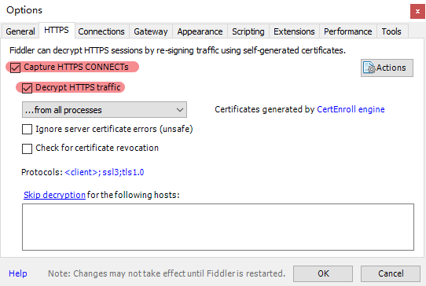
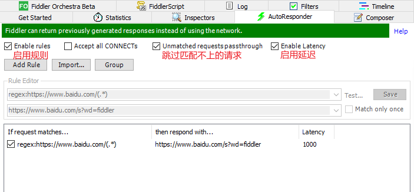
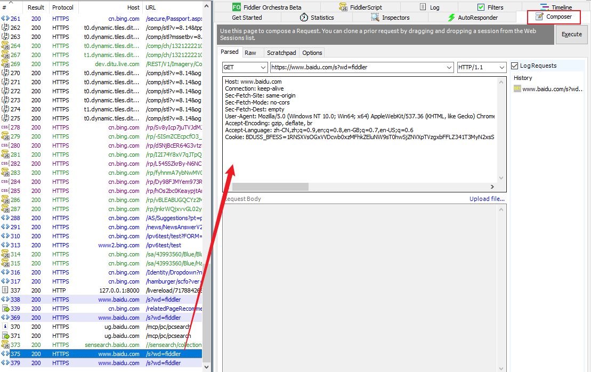
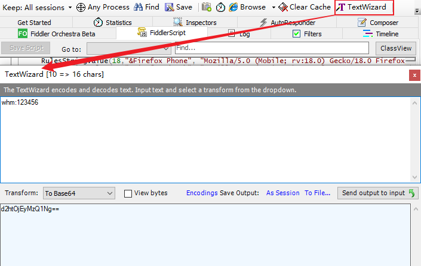
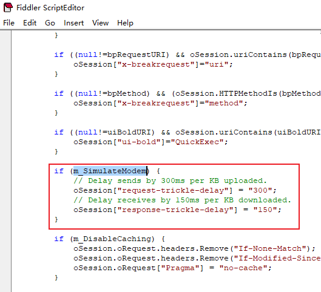

### 🚁 断点调试

Fiddler可以在请求发送至服务端前打断点，或者在服务端发响应结果时打断点(请求前，响应后)。

通过请求断点，在`Inspectors`选项卡可修改cookie、修改session、修改报文内容等。

https请求抓包，需要在`Tools`->`Options...`->`HTTPS`选项卡，勾选`Capture HTTPS CONNENCTS`等选项，并安装证书。



### 🚁 请求转发

在`AutoResponder`选项卡，增加转发规则，设置匹配请求的方式及转发的内容。



匹配请求的方式：

*  `EXACT`-精确匹配，如`EXACT:http://ip:port/xxx`

*  `regex`-以正则表达式匹配，如`regex:http://[^:]*:\d{4}/(.*)`

转发的内容可设置为其他http请求、url或者本地文件等。

!!!note "补充"

	若需设置延迅时间，右键规则->`Set Latency`设置时间（单位为毫秒），并勾选`enable latency`。

!!!note "补充"

	全局转发：`Tools`->`HOSTS...`中设置转发的域名。

### 🚁 构造请求

针对一些长流程进行接口测试时，可通过`Composer`，构造请求报文进行调试，待调通后再进行集成测试，提高效率。

通过此方式也可构造SQL注入、XSS注入payload，检查程序能否妥善处理。

1. 从捕获的请求列表，拖拽待测请求至右侧`Composer`选项卡，便可写入报文。
2. 修改请求报文，单击`Execute`按钮即可发送请求。



### 🚁 请求代理

1.`Tools`->`Options...`->`Connections`选项卡，设置端口号，勾选`Allow remote computers to connect`选项。

2.设置代理认证：`FiddlerScript`选项卡，在`OnBeforeRequest`方法中增加`Proxy-Authorization`，如：

```
static function OnBeforeRequest (oSession: Session) {
    oSession.oRequest ["Proxy-Authorization"] = "Basic d2htOjEyMzQ1Ng==";
    // 原方法的内容这里省略
    }
```

其中`Basic`的后半部分是将"用户名：密码"进行base64加密生成的，可以通过自带的`TextWizard`工具生成。



3.手机连接同区域网的WiFi后，手动配置代理，把机器IP及端口填入对应项。若设置了代理认证则还需填写用户名、密码。

此外，同域的计算机也可设置代理，将浏览器请求通过Fiddler代理后转发出去。

!!!note "补充"

    Fiddler首次勾选`Allow remote computers to connect`后可能会无网络连接，实测重启软件后即可。

### 🚁 模拟弱网

1.`Rules`->`Performance`->`Simulate Modem Speeds`，开启调制解调器。

2.`Rules`->`Customize Rules`或者`FiddlerScript`选项卡，搜索关键字`m_SimulateModem`，如下图。



默认配置为：每发送1KB延迟300ms；每接收1KB延迟150ms。可见Fiddler模拟弱网本质是设置延迟时间，相对的charles则是限制带宽的方式。

!!!note "补充"

    自定义规则时记得将`m_SimulateModem`的值修改为true，否则不会生效。

#### 🔧 弱网测试策略：

1. 正常网络时功能检查
2. 弱网时时功能检查，包括UI、交互、提示、数据
3. 无网络时功能检查
4. 从强网到弱网，至无网络的功能检查

参考资料：[Fiddler详解](https://www.cnblogs.com/cty136/p/11479142.html)

---
