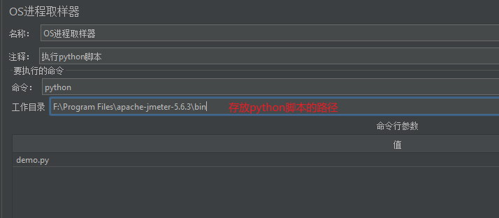
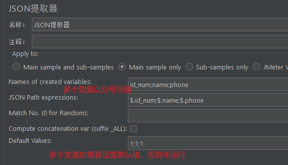

## 📌 使用JMeter进行压力测试

1. 用户定义的变量，内容包括线程数8、ramp_up_time启动所有线程所需时间、循环次数-永远、持续时间300s、启动延迟时间。
2. 登录请求线程组，搭配正则表达式提取器、BeanShell PostProcessor将token设置为全局变量。
3. Http请求默认值，包括协议、ip、端口、编码。
4. Http信息头管理器，包括报文类型、token等信息。
5. 被测请求线程组，包括事务控制器、csv数据文件（参数化）、请求、提取器、响应断言、断言结果、汇总报告。
6. 总体的结果树、报告、事务响应时间图
7. 生成html报告，平均响应时间200ms-1200ms

步骤参考: [202409.jmx](performance/202409.jmx)

执行参考:

=== "run.sh"
    
    ```shell
    #!/bin/bash
    current_datetime=$(date +%Y%m%d%H%M%S)
    mkdir -p "${current_datetime}"
    # touch "${current_datetime}/output.jtl"  # 无需先手动创建
    mkdir -p "${current_datetime}/results"
    jmeter -n -t 202409.jmx -l "${current_datetime}/output.jtl" -e -o "${current_datetime}/results"
    ```

!!! note "jmeter命令参数"

    -n: 非GUI模式执行
    -t: 执行测试文件所在的位置及文件名
    -r: 在所有分布式的执行机上运行
    -R：在指定的执行机上运行，如：-R ip1:port1,ip2:port2
    -l: 指定生成测试结果的保存文件，jtl文件格式
    -e: 测试结束后，生成html测试报告
    -o: 指定测试报告的存放位置
    -g: 使用jtl文件生成报告
    -j: 日志文件路径及文件，log文件格式


!!! tip "jmeter命令指定线程数"
    
    1. 线程数的值设置为`${__P(tmp_thread,50)}`
    2. 执行命令时带上参数`-G变量名及数值`，如  
    `jmeter -n -t 202409.jmx -l "${current_datetime}/output.jtl" -e -o "${current_datetime}/results -r -Gtmp_thread=50`

    若上述命令没有-r（即非分布式压测时），则使用`-J变量名及数值`即可。

参考资料: [JMeter压力测试完整流程](https://blog.csdn.net/m0_47747596/article/details/131658904)

### 🚁 仅一次控制器

控制仅使用一次的请求

### 🚁 吞吐量控制器

限制流量，吞吐量控制器-吞吐量设置为10.0，表示限流为10%。

### 🚁 事务控制器

当需要将多个请求一起统计时使用。

### 🚁 后置处理器

* 边界提取器，输入左边界/右边界，提取边界里的数据。
* 其他的还有json提取器、正则提取器、xpath提取器等。

### 🚁 并发

同步定时器，等待线程数到预设数量后触发事务，达到集合点的作用。应用场景如电商秒杀。

参数都设置为0时，代表等到线程组所有用户一起并发。

参考资料: [同步定时器](https://zhuanlan.zhihu.com/p/594119162?utm_id=0)

### 🚁 断言

* 响应断言，可以配置匹配响应文本、请求头、响应头等，或者设置包括、相等等规则
* 数据包字节大小断言
* 持续时间断言，判断是否在指定时间内返回响应结果
* beanshell断言

## 📌 使用自带函数

工具 -> 函数助手对话框，找需要用的函数调试。

=== "随机数示例"

    ```json
    {
        "id":"${__Random(100,105)}",  // 从100至105的序列中随机取数
        "phone":"${__chooseRandom(1.0.1,1.0.2,1.0.3)}"  // 从该列表中随机取数
    }
    ```

=== "加密示例"

    ```json
    {
        "passwprd": ${__digest(md5,${pass},,,)}  // 安装插件的话可以直接使用md5()
    }
    ```

## 📌 BeanShell调外部jar包方法

BeanShell取样器，支持直接运行`Java`代码（需符合BeanShell语法），可访问JMeter变量（如`vars.get("varName")`）和API。

但性能较低，**不推荐在高并发场景使用**。

1. jar包需要放JMeter目录的`lib\ext`目录下
2. jar包里调用的第三方jar包也要放到`lib`和`lib/ext`里
3. 记得重启JMeter，添加前置处理器: BeanShell PreProcessor，然后写脚本

=== "BeanShell PreProcessor"

    ```java
    import xx.Util;
    
    String sp = "18" + Integer.toString(${__Random(000000000,999999999,)});
    log.info("phonenum is" + sp);
    vars.put("phone",sp);
    String code = Util.encrypt(sp);
    
    // 存入变量，在脚本文本中通过${phone}引用，不能跨线程
    vars.put("phone",code);

    // 记录日志
    log.info("phonenum is" + vars.get("phone"));

    // props能跨线程，是hashtable对象
    props.put("phone",code);  // 在脚本文本中通过${__P(phone)}引用
    ```

参考资料: [jmeter引用jar包的3种方式](https://www.cnblogs.com/uncleyong/p/11475577.html)

## 📌 python+OS进程取样器 造仿真数据

OS进程取样器，通过系统`Shell`执行外部命令或脚本（如 .sh, .bat, .py 等）。

1. 右击线程组->添加取样器->OS进程取样器，并进行配置
2. 添加后置处理器->JSON提取器，并进行配置
3. 在请求报文中使用提取出来的变量，格式为`${变量名}`

=== "demo.py"

    ```python
    import json
    from faker import Faker
    from faker.providers import BaseProvider
    
    
    # 自定义数据
    class CustomFaker(BaseProvider):
        def prodid(self):
            # 假设是从库表或接口获取到的订购产品id
            prod_list = ["prodid1", "prodid2", "prodid3"]
            return self.random_element(prod_list)
    
    
    faker = Faker(locale='zh_CN')
    faker.add_provider(CustomFaker)
    result = {
        "id_num": faker.ssn(),
        "name": faker.name(),
        "phone": faker.phone_number(),
        "email": faker.email(),
        "address": faker.address(),
        "birthday": faker.date_of_birth().strftime("%Y-%m-%d"),
        "prodid": faker.prodid()
    }
    
    # print(json.dumps(result,ensure_ascii=False))  # JMeter中执行python反而这一行结果乱码
    print(json.dumps(result))

    ```

=== "OS进程取样器配置示例"

    

=== "JSON提取器配置示例"

    

=== "报文中使用变量示例"

    ```json
    {
        "name":"${name}",
        "id_num":"${id_num}",
        "phone":"${phone}"
    }
    
    ```

## 📌 JSR223取样器

JSR223取样器，支持多种脚本语言（如Groovy、JavaScript、Python等）。

编译缓存机制（Groovy）提升性能，**适合高并发场景**。

## 📌 响应报文的汉字乱码

解决方案:

1. 打开JMeter目录的`bin/jmeter.properties`文件
2. 搜索关键字: `sampleresult.default.encoding`
3. 去掉注释符，修改编码为UTF-8，即`sampleresult.default.encoding=UTF-8`
4. 重启JMeter

JMeter 5.6.1 之后的版本默认UTF-8编码，无需修改。

其他解决方案参考: [解决Jmeter响应报文中文乱码的问题-3种解决办法](https://blog.csdn.net/u013302168/article/details/126366082)

## 📌 使用插件

1. 下载插件: https://jmeter-plugins.org/downloads/old/
2. 解压后把`lib`文件夹扔到JMeter目录，重启JMeter。之后便可使用阶梯加压线程组、响应时间折线图、TPS折线图等组件。

### 🚁 mysql数据库压测

1.查mysql版本号: `mysql --version`

或者连上mysql后`select version();`

2.配置端口（默认3306），重启服务`systemctl restart mysqld`


=== "/etc/my.cnf"

    ```text
    [mysqld]
    port=3306
    ```

=== "jdbc.properties"

    ```text
    mysqlbase.port=3309
    ```

3.脚本设计

[下载插件](https://downloads.mysql.com/archives/c-j/)，解压后把jar放到jMmeter/lib/ext目录。

JMeter中添加：

* 取样器 -> `JDBC Request`，Query主要包括核心业务的SQL语句。
* 配置元件 -> `JDBC Connection Configuration`，填写配置包括JDBC Driver class、Database URL(jdbc:mysql://ip:端口/库名)、用户名、密码、连接池(跟取样器的连接池变量名保持一致)。

连接池的作用: 预先创建一定数量的、保持活跃的连接供请求复用，避免频繁地建立和关闭连接所带来的延迟。  
这里用于模拟多线程高并发访问的场景。

## 📌 使用代理服务器录制脚本

参考资料: [jmeter代理服务器录制脚本教程（入门篇）](https://blog.csdn.net/weixin_42614544/article/details/109514086)

## 📌 报告分析

参考资料:

https://blog.csdn.net/m0_61066945/article/details/136062323

https://blog.csdn.net/qq_24394093/article/details/90732577

* 验证最大并发用户数
* 错误率-不超过0.2%
* 响应时间-不超过3秒
* GC频率不能过高，影响性能。理想情况下，几天或几周发生一次。
* 服务器资源，CPU、内存使用率小于80%

## 📌 分布式集群压测

单台压力机，资源不足以触发足够多的并发时，采用分布式集群压测。

采用主从架构，一台控制机作为master，负责测试执行和结果收集。

其他机器作为压力机，执行实际的测试负载。**jmx文件无需上传到压力机**，但若涉及参数化，则需要将文件放到压力机的`jmeter/bin`目录下。

### 🚁 1.修改控制机配置

=== "jmeter/bin/jmeter.properties"

    ```shell
    # 设置为true，不使用加密认证传输
    server.rmi.ssl.disable=true
    # 设置压力机的ip及端口，逗号分隔。资源不够用时，可以将主机也作为压力机使用
    remote_hosts=127.0.0.1:1099
    # 分布式压测时默认没有响应结果返回，如有需要，则设置为`Standard`
    mode=Standard
    ```

=== "jmeter/bin/jmeter-server"

    ```shell
    # 确保主机和从机可以互相识别和连接
    `RMI_HOST_DEF=-Djava.rmi.server.hostname=本机内网IP`
    ```

### 🚁 2.修改压力机配置

关闭防火墙: `systemctl stop firewalld.service`

=== "jmeter/bin/jmeter.properties"

    ```shell
    # 设置为true，不使用加密认证传输
    server.rmi.ssl.disable=true
    ```

=== "jmeter/bin/jmeter-server"

    ```shell
    # 确保主机和从机可以互相识别和连接
    `RMI_HOST_DEF=-Djava.rmi.server.hostname=本机内网IP`
    ```

### 🚁 3.开始压测

1.参与压测的机器都启动`jmeter-server`服务。

2.启动

* 图形化界面远程启动：运行->远程启动->远程启动所有
* 命令启动: `jmeter -n -t 202409.jmx -l "${current_datetime}/output.jtl" -e -o "${current_datetime}/results" -r`

此时实际总的线程数 = jmx脚本中设置的线程数 * 压力机的个数

## 📌 面试题

### 🚁 在分布式性能测试中，如何处理数据同步和结果合并的问题

在分布式性能测试中，数据同步通常通过共享文件系统或数据库来实现，结果合并则通过集中收集日志和使用工具进行分析。

数据同步策略 

* 共享存储: 如共享文件、mysql、redis
* 共享资源加时间戳或节点标识
* 消息队列协调

结果合并方式

* 中心化收集器: 节点的测试结果上传至中心节点，由中心节点负责聚合、去重、排序等。
* 日志聚合: 节点输出结构化日志如JSON，通过ELK统一采集分析。
* 指标汇总工具: Prometheus + Grafana 收集各节点的性能指标，实现可视化监控和聚合展示。
* 结果文件合并: 如`cat node1_result.csv node2_result.csv > merged_result.csv`

JMeter分布式压测支持主从模式，主节点下发脚本，仅参数化文件需上传到各工作节点。压测结束后主节点自动合并结果。

Locust分布式压测，默认单节点运行（支持多线程/协程）。若要实现多个Locust实例之间的数据同步，需要借助外部组件或机制。

---